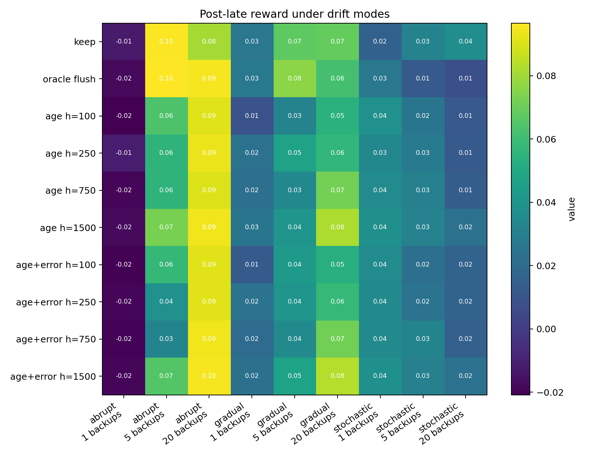
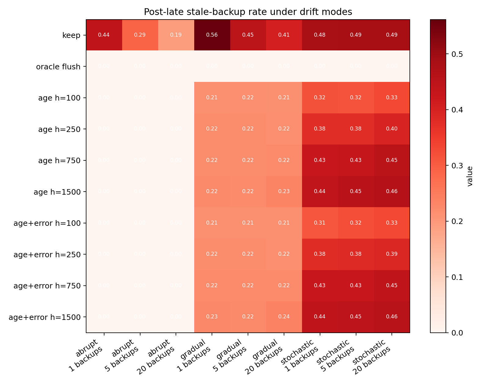
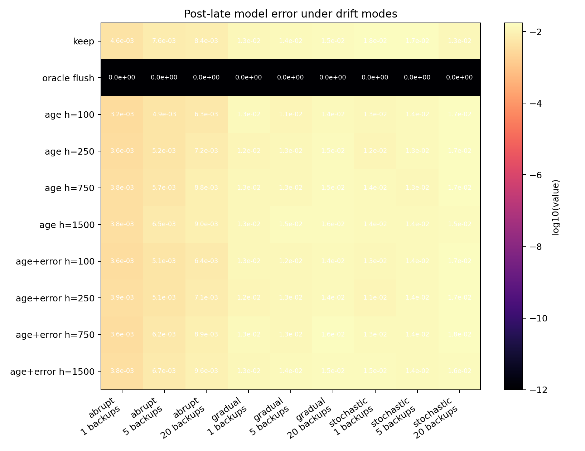
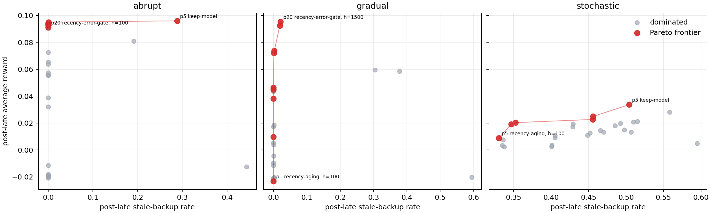

# Continual Dyna With Model Aging

## Abstract

Dyna-style planning is attractive for a continual agent because it reuses a learned model to improve value estimates without requiring more real interaction. In a nonstationary world, the same mechanism can amplify obsolete knowledge. This proposal studies model freshness as a first-class Core RL question: can a small online agent age or distrust model entries so that planning remains useful after the environment changes? The newest analysis adds a reward/staleness Pareto frontier for the drift extension, making the search-control tradeoff clearer than a single reward winner table.


## Standalone Study Summary

This study asks when a continual Dyna agent should trust its learned model after the world changes. The RL problem is a continuing gridworld whose layout changes midstream; the agent keeps acting and learning without reset. The implemented methods compare no planning, random keep-model planning, oracle model flushing, recency-weighted model aging, and recency/error-gated model aging. The extended experiment varies planning budgets `0, 1, 5, 20`, model-handling rules, and aging half-lives `250, 750, 1500, 4000`; the main metrics are average reward, stale-backup rate, model error, planning TD magnitude, and post-change recovery window. The fixed-change result shows that freshness-aware sampling sharply reduces stale backups. Reward improvement is real in some high-budget settings but depends on the half-life and budget, so the final claim should be about search-control freshness rather than universal reward superiority. A second completed drift experiment tests abrupt, gradual, and stochastic nonstationarity. Its results support freshness-aware high-budget planning in abrupt and gradual drift, but not a universal advantage in stochastic drift, where keep-model planning remains competitive and the reward differences are noisy. The added Pareto-frontier analysis explicitly separates reward winners from low-staleness computation tradeoffs.

## Proposal Template Answers

Focused RL question: In a continual Dyna agent, when should learned model entries stop receiving planning computation after the environment changes? The proposal studies planning trust and search-control freshness, not simply whether "more planning" improves reward.

Setting and testbed: The main testbed is a continuing gridworld with a midstream layout change and no agent reset. It is large enough for planning to matter and small enough to label stale model entries, which makes model-freshness diagnostics possible. A second completed drift testbed uses abrupt, gradual, and stochastic phase changes to test whether the model-aging tradeoff survives outside a single clean switch.

Implemented comparison: The implemented comparison includes no planning, keep-model Dyna, oracle model flushing, recency aging, and recency/error gating across planning budgets and aging half-lives. The oracle flush condition is explicitly diagnostic; it is not a realistic algorithm.

Observation or figure that answers the question: The main evidence is the relationship among late reward, stale-backup rate, model error, planning budget, and half-life. A useful result can be a tradeoff curve rather than one winner: the question is how model freshness changes the value of computation.

Compute need and fallback: The 20-seed abrupt-change grid is complete. The drift extension is also complete with 10 seeds configured, 1,800,900 metric rows, and 690 condition groups. The honest fallback is no longer "drift pending"; it is that the first drift extension is broad enough to qualify the claim, but still not broad enough to cover repeated naturalistic changes or larger stochastic state spaces.

## Independent Research Scope

This is an independent planning study about search control under model aging. It asks how a continual agent should decide which parts of a learned model deserve planning after knowledge becomes stale. The core object is not total planning budget alone, but the freshness and trustworthiness of the model entries selected for simulated backups.

The report does not study replay buffers or offline model learning. The model is compact, updated online, and queried for planning backups. This distinction is central to the course constraints: old experience is not stored and replayed; instead, the agent maintains a learned model whose entries may become obsolete.

## Evidence Level

Evidence level: strong evidence for abrupt nonstationarity and model-freshness diagnostics. The completed result uses 20 seeds, four planning budgets, multiple model-handling rules, and four aging half-lives. It directly measures stale-backup rates and model error, so the evidence supports a mechanism claim rather than only a reward claim.

The drift extension adds moderate evidence beyond the abrupt-change grid. It uses `experiments/alberta_core_rl/results/continual_dyna_model_aging_drift/20260709T085809Z_extended`, with abrupt, gradual, and stochastic nonstationarity. The post-late windows have full seed coverage in the inspected headline conditions, while some narrow early recovery windows have partial seed coverage. This extension supports a sharper claim: model freshness is valuable search-control information when planning computation is large and the nonstationarity has a recoverable temporal structure, but stochastic drift does not show a clean model-aging advantage.

## Paper-Style Contribution And Claim Boundaries

The contribution is a planning-computation analysis rather than another Dyna reward curve. The report treats model freshness as a variable that controls which simulated backups receive scarce computation, and it measures stale-backup rate alongside reward and model error. This directly addresses the Alberta Plan problem of how a long-lived agent manages learned models under ordinary experience.

The claim boundary is that the result is strongest when stale model entries are diagnosable and the environment has enough temporal persistence for planning to help. It shows that recency and recency/error search control can reduce stale computation without an oracle change signal, but it does not prove that one half-life or aging rule is universally optimal. The drift extension already weakens any overbroad claim: stochastic drift is not won by model aging in the present experiment, so the defensible contribution is a conditional search-control account.

## Research Motivation

The Alberta Plan gives learned models and planning a central role in a long-lived agent. The hard version of planning is not stationary gridworld acceleration; it is deciding which learned predictions still deserve computation. A replay-buffer framing would store old experience and sample it later, but this project instead uses a compact learned model whose entries are updated online. That distinction matters: the question is not how to train from old data, but how a streaming agent should allocate background computation when its model may be wrong.

The central difficulty is that planning can be useful before a change and harmful after a change for the same reason: it amplifies whatever the model currently believes. The study therefore treats freshness as part of search control. A stale model entry is not just inaccurate data; it is a claim on scarce computation that may push value estimates in the wrong direction.

## Research Question

How should a small continual Dyna agent allocate planning backups when model knowledge has unknown freshness?

Subquestions:

- How much pre-change benefit is lost when model entries are aged aggressively?
- Can stale-backup diagnostics predict post-change recovery?
- Is flushing the model too crude compared with gradual aging?
- Does prioritizing recent model error improve real-step reward or only make planning look cleaner?
- Does the model-aging tradeoff survive gradual and stochastic nonstationarity, or is it mainly an abrupt-change diagnostic?

## Related Work

The Alberta Plan frames transition models and background planning as components of a base agent. Average-reward learning/planning work motivates continuing objectives. Classic Dyna and prioritized sweeping motivate model-based backups and search control. Continual RL foundations motivate process metrics such as recovery time and adaptation rather than final policy score alone.

Useful local sources:

- `resources/alberta_plan_related/alberta_plan_2208.11173.pdf`
- `resources/alberta_plan_related/average_reward_learning_planning_2006.16318.pdf`
- `resources/alberta_plan_related/rethinking_foundations_continual_rl_2504.08161.pdf`

## Research Method

The agent maintains a compact state-action model:

- estimated next state,
- estimated reward,
- last update time,
- count or confidence,
- recent prediction error.

Planning variants:

- No planning.
- Random Dyna with kept model.
- Flush-on-change oracle diagnostic.
- Recency-aged Dyna: planning priority decays with time since real observation.
- Error-gated Dyna: entries with recent high model error are temporarily suppressed.

A stale-error-prioritized variant, where backups are chosen by a mixture of TD priority and model freshness, is a planned extension rather than part of the current result. The completed extended evidence uses `keep_model`, `no_planning`, `oracle_flush`, `recency_aging`, and `recency_error_gate`.

The flush-on-change variant is not realistic; it is an upper-bound diagnostic showing what would happen if the agent had a perfect change detector.

## Experimental Design

Primary environment:

- Continuing gridworld with goals and hazards.
- Midstream layout change with no reset.
- Planning budgets `0, 1, 5, 20`.
- Aging half-lives `250, 750, 1500, 4000` steps in the extended code path.
- Seeds `0-19` for the current extended result.

Second-round drift extension:

- Runner: `continual_dyna_model_aging_drift`.
- Completed result: `experiments/alberta_core_rl/results/continual_dyna_model_aging_drift/20260709T085809Z_extended`.
- Evidence scale: 10 seeds configured, 20,000 steps per seed, 1,800,900 metric rows, and 690 condition groups.
- Drift modes: abrupt switch, gradual phase mixing, and stochastic phase changes.
- Purpose: test whether model aging still helps when nonstationarity is not a single clean change point.
- Coverage note: headline post-late comparisons have 10 seeds; some narrow early post-switch bins have partial seed coverage and are not used for the headline claim.

Metrics:

- Real-step average reward.
- Pre-change AUC.
- Post-change recovery time.
- Stale-backup rate.
- Model one-step prediction error.
- Reward/staleness Pareto frontier and planning TD magnitude as computable diagnostics from the current logs. A true per-backup causal utility measure remains future work because the current runner logs aggregate planning TD magnitude rather than counterfactual value improvement per simulated backup.
- Fraction of planning spent on entries not observed recently.

## Experiment Design Rationale

The experiment uses a changing gridworld because stale model entries can be identified and counted. That diagnostic visibility is necessary for the research question: a reward curve alone cannot tell whether planning helps because the model is useful or hurts because the model is obsolete. Planning budgets `0, 1, 5, 20` separate the no-planning baseline, low-compute regime, and high-compute regime where stale backups can dominate.

The half-life sweep is the main scientific control. A very short half-life should distrust old knowledge quickly and may throw away still-useful structure; a long half-life should preserve more knowledge but risk stale backups. The correct outcome is therefore not necessarily one best half-life, but a map of when freshness helps and when it merely reduces planning.

## Expected Results And Failure Modes

Expected pattern: random keep-model Dyna should achieve strong pre-change performance but high stale-backup rates after change. Flush should remove stale backups but may lose useful knowledge. Aging should form an intermediate regime: less stale than keep-model and less abrupt than flush, with performance depending on the half-life.

Failure modes:

- Aging may be equivalent to lowering planning budget.
- Model error may be delayed because the agent stops visiting changed states.
- A deterministic gridworld may make stale detection too easy.
- Stochastic drift may make aggressive aging unnecessarily pessimistic.

## Interpretation Standard

The proposal succeeds if it explains when planning computation should be trusted. It does not need a universally best aging rate; a tradeoff curve is scientifically valuable if it reveals how model freshness, planning budget, and recovery interact.

## Results

The current extended result is:

`experiments/alberta_core_rl/results/continual_dyna_model_aging/20260709T024602Z_extended`

Main result:

- Freshness-aware sampling reduces stale-backup rate without oracle change detection.
- At planning budget `20`, keep-model stale-backup rate in the late post-change window is `0.213 +/- 0.065`. Recency aging reduces this to essentially zero at half-life `250`, to `0.00058 +/- 0.00017` at half-life `1500`, and to `0.0204 +/- 0.0044` at half-life `4000`.
- Late reward at planning budget `20` is `0.0828 +/- 0.0113` for keep-model and `0.0906 +/- 0.0060` for oracle flush. Recency aging ranges from `0.0865` to `0.0925` depending on half-life; recency/error gating ranges from `0.0822` to `0.0925`.
- At planning budget `5`, keep-model and oracle flush have strong late reward around `0.096-0.097`, while aggressive aging half-lives `250` and `750` reduce stale backups but also hurt late reward. This shows that freshness control is not automatically better; it must match the planning budget and environmental time scale.
- At planning budget `1`, stale-backup reduction is visible but reward remains weak for all methods. There may not be enough planning computation for search-control improvements to translate into behavior.

Main figures below use late post-change seed-tail condition summaries. The heatmaps are now the primary result view because they avoid the compressed legends that made the earlier many-series plots hard to read. Rows encode planning budget and model handling, columns encode aging half-life or non-aged controls, and color encodes the measured outcome. This layout makes the central tradeoff visible: freshness-aware planning strongly changes stale-backup rate, while reward depends jointly on budget and half-life.


The bar-summary figures remain useful secondary checks because they show seed uncertainty directly. They should be read after the heatmaps: the heatmaps identify which regimes matter, and the confidence-interval figures confirm whether the differences are robust across seeds.


The completed drift extension asks whether the same freshness logic survives abrupt, gradual, and stochastic nonstationarity. The result path is `experiments/alberta_core_rl/results/continual_dyna_model_aging_drift/20260709T085809Z_extended`. The headline comparison below uses phase-1 post-late seed-tail groups, treats `oracle_flush` as a diagnostic rather than a realistic method, and reports the highest-reward non-oracle condition for each drift mode. This criterion is intentionally conservative: it lets keep-model win when model aging does not improve behavior, while the interpretation column records whether an aging rule still gives a better computation tradeoff.

| Drift mode | Best realistic method | Keep-model baseline | Reward | Stale-backup rate | Model error | Interpretation |
|---|---|---|---|---|---|---|
| Abrupt | `dyna_5_keep_model` | same | `0.09598 +/- 0.00112` | `0.28869` | `0.00762` | Best reward is ordinary Dyna, but `dyna_20_recency_error_gate` with half-life `1500` is nearly tied (`0.09501 +/- 0.00141`) and cuts stale backups to `0.00056`. |
| Gradual | `dyna_20_recency_error_gate`, half-life `1500` | `dyna_20_keep_model` | `0.09536 +/- 0.00141` vs `0.05945 +/- 0.03210` | `0.02092` vs `0.30444` | `0.01201` vs `0.01168` | Freshness-aware high-budget planning is the clear reward and stale-computation winner; model error is similar, so the gain is mainly search control. |
| Stochastic | `dyna_5_keep_model` | same | `0.03370 +/- 0.01237` | `0.50431` | `0.01649` | No model-aging winner in the current stochastic setting; the best phase-1 aging condition is lower reward (`dyna_20_recency_aging`, half-life `1500`, `0.02495 +/- 0.01113`) despite a lower stale rate (`0.45612`). |

The planning-budget pattern is central. Aggregated post-late average reward rises with planning depth for abrupt drift (`-0.01772`, `0.06339`, `0.09155` for planning `1`, `5`, `20`) and gradual drift (`-0.02145`, `0.01760`, `0.06365`), but not for stochastic drift (`0.01737`, `0.01367`, `0.01183`). This means model freshness cannot be evaluated separately from the computation regime: when extra planning is actually beneficial, freshness-aware search control can change the quality of that computation; when stochastic drift makes planning less reliable, aging may simply suppress or redirect computation without improving behavior.







The new Pareto-frontier analysis provides a cleaner view of the drift extension. Each point is a realistic non-oracle post-late condition; a point is on the frontier if no other realistic condition has both higher reward and lower stale-backup rate in the same drift mode. This is a better search-control diagnostic than only naming the highest reward condition, because model aging can be valuable by reducing stale computation even when a keep-model baseline has slightly higher reward.



| Drift mode | Highest-reward frontier point | Lowest-stale frontier point | Interpretation |
|---|---|---|---|
| Abrupt | `dyna_5_keep_model`: reward `0.09598 +/- 0.00112`, stale `0.28869` | `dyna_20_recency_error_gate`, half-life `100`: reward `0.09118 +/- 0.00551`, stale `0.00000` | Keep-model wins reward by a small margin, but freshness-aware high-budget planning provides a near-reward-preserving low-staleness alternative. |
| Gradual | `dyna_20_recency_error_gate`, half-life `1500`: reward `0.09536 +/- 0.00141`, stale `0.02092` | `dyna_1_recency_aging`, half-life `100`: reward `-0.02317 +/- 0.00132`, stale `0.00000` | The useful frontier region is high-budget recency/error gating; the zero-stale endpoint is not useful because it throws away too much planning value. |
| Stochastic | `dyna_5_keep_model`: reward `0.03370 +/- 0.01237`, stale `0.50431` | `dyna_5_recency_aging`, half-life `100`: reward `0.00886 +/- 0.00318`, stale `0.33054` | The frontier makes the negative result explicit: reducing stale backups in this stochastic setting does not translate into better reward. |

## Analysis

The main interpretation is that planning value depends on both computation budget and model freshness. A high planning budget can amplify useful model knowledge before a change, but the same budget can amplify stale entries afterward. Recency aging and recency/error gating are therefore best read as search-control mechanisms: they change which model entries receive computation, not merely how many backups are performed. The strongest evidence is the divergence between stale-backup reduction and reward ranking. Very aggressive aging can make the stale-backup metric look clean while losing useful structure, whereas longer half-lives can preserve reward but allow some stale planning. The drift extension adds an important qualification: freshness-aware planning is most persuasive under abrupt and gradual drift, while stochastic drift makes the reward advantage disappear in the current testbed. The Pareto frontier sharpens this point: abrupt drift has a near-reward-preserving low-staleness alternative, gradual drift has a genuinely high-reward freshness-aware frontier point, and stochastic drift has only a weak tradeoff where stale reduction buys little control performance.

## Reviewer Critique And Revisions

Strict reviewer challenge: "This is just Dyna-Q with a changing maze." Response: the proposal must report model-freshness diagnostics and planning utility, not only reward.

Strict reviewer challenge: "Flush-on-change is unrealistic." Response: it is retained only as an oracle diagnostic; realistic variants must use recency or prediction error computed from the stream.

Reviewer Audit Matrix:

| Reviewer angle | Critique | Action taken | Remaining risk |
|---|---|---|---|
| Alberta Plan | Planning should be about learned models in ordinary experience, not offline replay. | Uses an online learned model with planning backups and no replay buffer. | The environment is still compact and synthetic. |
| Planning reviewer | Reward alone cannot diagnose stale planning. | Reports stale-backup rate, model error, planning budget, half-life, and a reward/staleness Pareto frontier. | True counterfactual planning utility per backup is still not logged. |
| Nonstationarity reviewer | Abrupt change may make aging look too easy. | Completed a first abrupt/gradual/stochastic drift extension and narrowed the conclusion. | Still needs repeated changes and larger stochastic transition settings. |
| Statistics | Half-life sensitivity can be hidden by one curve. | Current report figures separate half-life in the legend, report numerical examples, and add a compact reward/staleness frontier. | Repeated-change statistics are still missing. |
| Strict instructor | Do not claim universal reward superiority. | Report emphasizes stale-backup reduction and tradeoffs. | Some reward comparisons remain budget-dependent. |

## Threats To Validity

The fixed-change environment uses an abrupt gridworld layout change, which makes stale model entries easy to define and inspect. That is useful for mechanism diagnosis but may overstate how cleanly freshness can be detected in more natural stochastic worlds. The drift extension directly addresses part of this concern and shows a mixed answer: abrupt and gradual changes still support freshness-aware high-budget planning, while stochastic drift is low-reward, noisy, and not won by model aging. The extended runs also show half-life sensitivity: aggressive aging can reduce stale backups while hurting reward at planning budget `5`. Conclusions should therefore emphasize the search-control tradeoff, stale-backup rate, model error, and recovery windows rather than only mean reward. A fuller study should add repeated changes, stochastic transition families with clearer controllability structure, and planning-utility diagnostics per simulated backup.

## Conclusion

This proposal turns Dyna from a generic "more planning helps" story into a sharper Core-RL question about when a continual agent should trust its learned model. The extended run supports the idea that model freshness is a first-class planning variable: recency and recency/error gating sharply reduce stale backups without oracle change detection. The reward story is more conditional than the pilot suggested; the best freshness setting depends on planning budget, half-life, and the temporal structure of nonstationarity. The completed drift extension shows that the abrupt-change conclusion partly survives gradual drift but not stochastic drift as a clean reward advantage. That mixed result makes the proposal stronger, not weaker, because it identifies the boundary where model freshness is useful search-control information.

## Reproduction

Current extended result:

```bash
cd /mnt/shared-storage-user/yupeng/Core-RL

PYTHONNOUSERSITE=1 MPLCONFIGDIR=/mnt/shared-storage-user/yupeng/Core-RL/.mplconfig \
  /data/yupeng/conda_envs/core-rl/bin/python experiments/alberta_core_rl/scripts/run_experiment.py \
  --config experiments/alberta_core_rl/configs/continual_dyna_model_aging/config_extended.json

PYTHONNOUSERSITE=1 MPLCONFIGDIR=/mnt/shared-storage-user/yupeng/Core-RL/.mplconfig \
  /data/yupeng/conda_envs/core-rl/bin/python experiments/alberta_core_rl/scripts/plot_report_figures.py \
  --result-dir experiments/alberta_core_rl/results/continual_dyna_model_aging/20260709T024602Z_extended \
  --kind dyna-aging

PYTHONNOUSERSITE=1 MPLCONFIGDIR=/mnt/shared-storage-user/yupeng/Core-RL/.mplconfig \
  /data/yupeng/conda_envs/core-rl/bin/python experiments/alberta_core_rl/scripts/run_experiment.py \
  --config experiments/alberta_core_rl/configs/continual_dyna_model_aging_drift/config_extended.json

PYTHONNOUSERSITE=1 MPLCONFIGDIR=/mnt/shared-storage-user/yupeng/Core-RL/.mplconfig \
  /data/yupeng/conda_envs/core-rl/bin/python experiments/alberta_core_rl/scripts/plot_report_figures.py \
  --result-dir experiments/alberta_core_rl/results/continual_dyna_model_aging_drift/20260709T085809Z_extended \
  --kind dyna-aging-drift \
  --figure-dir final/reports/integrated/continual_dyna_model_aging/drift_figures

PYTHONNOUSERSITE=1 PYTHONPYCACHEPREFIX=/tmp/core-rl-pycache MPLCONFIGDIR=/mnt/shared-storage-user/yupeng/Core-RL/.mplconfig \
  /data/yupeng/conda_envs/core-rl/bin/python experiments/alberta_core_rl/scripts/analyze_dyna_frontier.py \
  --result-dir experiments/alberta_core_rl/results/continual_dyna_model_aging_drift/20260709T085809Z_extended \
  --out-dir final/reports/integrated/continual_dyna_model_aging/drift_figures
```
