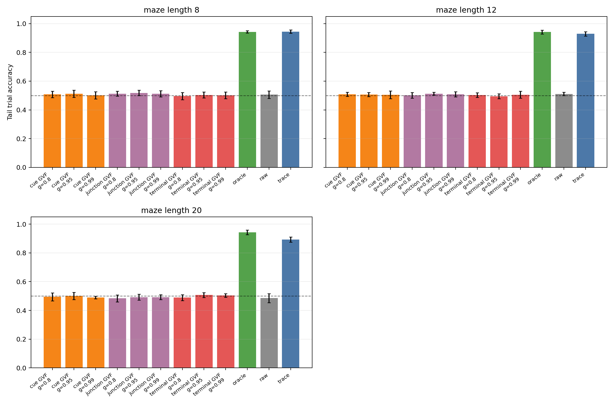
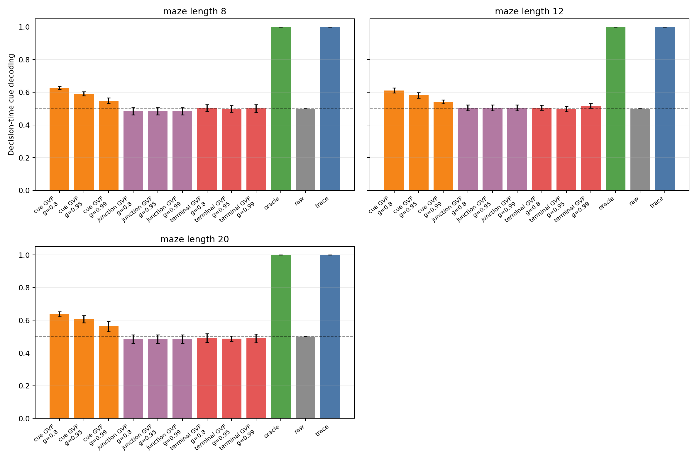
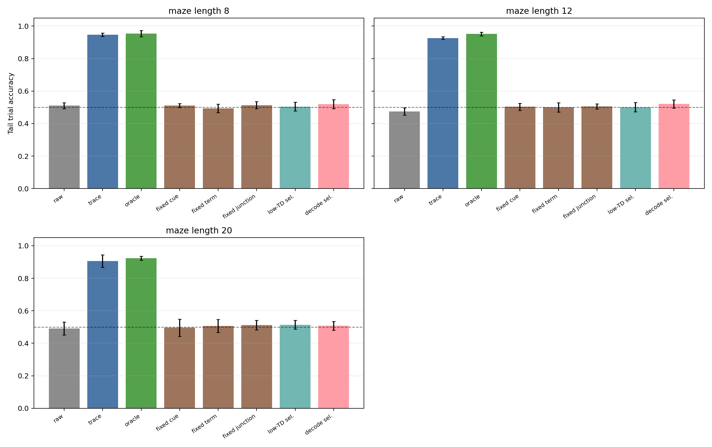
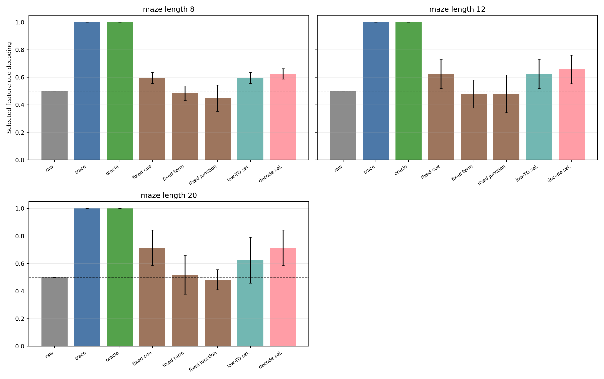
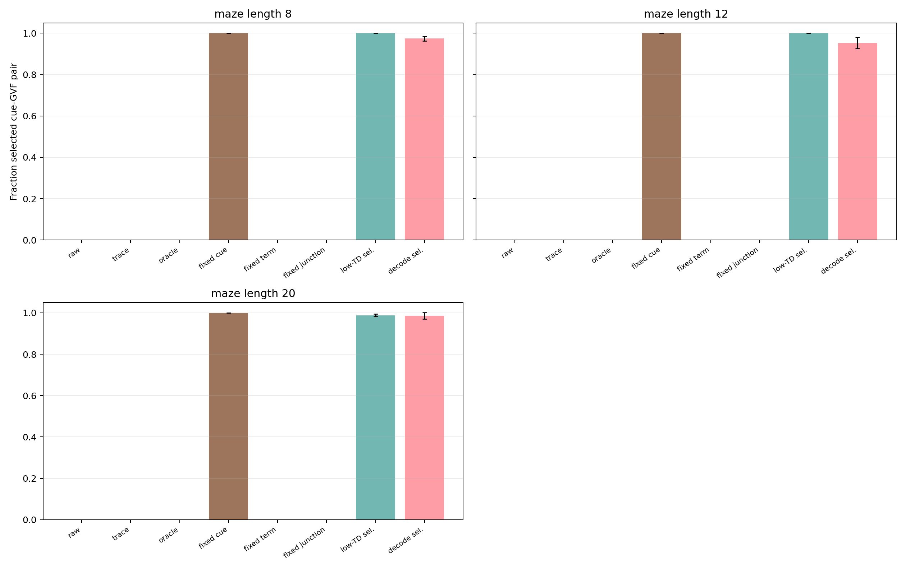

# Useful Predictive Knowledge Under Partial Observability

Status: independent integrated Core-RL proposal with completed Gate-1/Gate-2 evidence and a completed Gate-3 feature-budget selection experiment. This study asks when a learned prediction becomes usable state for online control, not whether adding a prediction head improves a score.

## Abstract

The Alberta Plan places predictive knowledge near the center of agent state, but the phrase "learned prediction" hides three different requirements: the prediction must contain information about what matters, the control learner must be able to use that information at the decision time, and a resource-limited agent must prefer that prediction over easier but irrelevant predictions. This proposal studies those requirements in a partially observable T-maze where a cue appears only at the start and the agent must remember it until a later junction. The experiments compare raw observation, hand-coded trace memory, oracle memory, GVFs with different cumulants and horizons, and a two-feature budget gate with fixed and selected predictive features. The main claim is not that GVFs are good or bad in general; the claim is that useful predictive knowledge should pass explicit information, control, and feature-budget gates before it is promoted to agent state.

## Standalone Study Summary

This study asks whether online learned predictions can become useful state under partial observability and limited computation. The RL problem is an aliased T-maze: the observation at the junction does not reveal which action is correct, so successful control requires carrying an early cue through a corridor. The first implemented comparison uses linear Sarsa control with raw observations, trace memory, oracle cue memory, and GVF features built from cue, terminal-outcome, or junction cumulants at horizons `gamma = 0.8, 0.95, 0.99`. The second implemented comparison imposes a two-feature state budget and asks whether fixed cue-GVF features, fixed irrelevant GVF features, a low-TD-error selector, or an oracle cue-decoding selector survives the budget and improves control. The experiments vary maze length and measure trial accuracy, decision-time cue decodability, selected-feature identity, selected-feature decoding, GVF TD error, and control TD error. A positive result requires a learned prediction to be cue-informative, selected under a limited budget, and control-useful; low prediction error alone is not enough.

## Proposal Template Answers

Focused RL question: When does learned predictive knowledge become usable state for an online control agent under partial observability?

Setting and testbed: The primary testbed is a continuing stream of T-maze trials with a transient binary cue, an aliased corridor, and a delayed junction decision. The setting is small enough for complete instrumentation but not vacuous: raw observation is insufficient, trace and oracle memory show the task is solvable without deep networks, and GVF features must prove that they preserve the control-relevant hidden cue.

Implemented comparison: The Gate-1/Gate-2 experiment compares raw observation, trace memory, oracle cue memory, cue-GVFs, terminal-outcome GVFs, and junction/bias GVFs. GVF horizons are swept over `0.8`, `0.95`, and `0.99`. The Gate-3 experiment fixes the state budget to two extra features and compares raw budget zero, trace memory, oracle memory, fixed cue-GVF, fixed terminal-GVF, fixed junction-GVF, a low-TD-error selector, and an oracle cue-decoding selector. All agents learn online with linear TD/Sarsa, no replay buffer, no deep network, and no offline training loop.

Observation or figure that answers the question: The primary evidence is the pair of decision-time cue decoding and trial accuracy by maze length and predictive question, followed by the feature-budget evidence for selected cue decoding, selected cue-GVF survival, and trial accuracy. A prediction that is accurate but cue-undecodable fails the information gate. A prediction that is cue-decodable but does not improve action accuracy fails the control-utilization gate. A prediction that can be selected under a budget but still does not improve trial accuracy fails the prediction-to-policy coupling gate.

Compute need and fallback: The experiment is CPU-scale. The fallback is scientifically meaningful: if GVFs reduce TD error but do not improve decodability or control, the conclusion is that prediction accuracy is not sufficient for useful agent state in this setting.

## Independent Research Scope

The question, method, and conclusion are defined entirely within this T-maze predictive-state study. The experiment uses one environment family and one staged criterion: predictive knowledge is useful only if it carries the hidden variable, survives a limited state budget, and improves downstream control. The current report now includes a first feature-budget selection gate. Plasticity under changing cue relevance remains outside the completed evidence and should be treated as the next stage rather than as a solved result.

The scope is deliberately narrower than a full Oak-style utility agent. This report studies the first necessary gate for learned knowledge: information and usability. It does not claim to solve feature discovery, option discovery, off-policy GVF stability, or long-term component management.

## Evidence Level

Evidence level: completed 10-seed Gate-1/Gate-2 main study plus completed 8-seed Gate-3 feature-budget study. The Gate-1/Gate-2 run `experiments/alberta_core_rl/results/useful_predictive_knowledge/20260709T102402Z_main` uses 10 seeds, 12000 online steps, maze lengths `8`, `12`, and `20`, three baseline state constructions, three GVF question types, and three GVF horizons. The Gate-3 run `experiments/alberta_core_rl/results/useful_predictive_knowledge_budget/20260709T132025Z_main` uses 8 seeds, 8000 online steps, the same maze lengths, and eight budgeted state-construction or selection conditions. Together they support a bounded mechanism claim: cue-GVFs can carry above-chance hidden-cue information and can be selected by a cue-decoding criterion, but none of the learned GVF conditions turns that information into reliable control in this experiment.

## Research Motivation

A long-lived agent cannot treat all predictions as useful knowledge. Some predictions are easy to learn because their cumulants are frequent, local, or low variance; others are useful because they reveal a hidden variable at the time a decision must be made. These are not the same property. The Alberta Plan motivates agents that learn many value functions from ordinary experience, but it also raises a utility question: which learned signals deserve to become part of the agent's state?

Partial observability makes the question concrete. In the T-maze, the current observation at the junction is aliased. The agent must carry information from the initial cue to the later action. A hand-coded trace can do this cheaply; oracle memory can do it perfectly. A learned predictive feature must therefore be judged against two standards: does it preserve the cue, and does linear control use it?

## Research Questions

RQ1: Which predictive questions preserve the hidden cue at decision time: immediate cue cumulants, delayed terminal-outcome cumulants, or generic junction/bias cumulants?

RQ2: How does prediction horizon affect the tradeoff between cue retention and prediction usability as maze length increases?

RQ3: Does cue decodability translate into control accuracy, or can a learned prediction contain weak hidden-state information that the control learner still fails to use?

RQ4: Under a two-feature state budget, do selection criteria retain cue-relevant predictions, or do they prefer easy but irrelevant predictions?

RQ5: What failure mode should guide the next stage: poor predictive information, poor output scaling, poor control utilization, or the need for plasticity after the prediction-to-policy coupling problem is solved?

## Related Work

The Alberta Plan motivates ordinary experience, value functions, GVFs, and agent-state construction. Horde-style GVF work shows why many predictions can be learned in parallel, but the current study asks a different question: which predictions should be trusted as state? Work on finding useful predictions motivates the cue-decoding and downstream-control gates, because predictive accuracy alone can reward easy questions rather than useful questions. Online agent-state construction motivates the trace/oracle controls: a candidate state feature should be compared to cheap memory baselines before claiming that prediction has solved partial observability. Streaming RL work motivates the no-replay constraint and the decision to use online linear learners rather than offline representation learning.

Useful local sources include `resources/alberta_plan_related/alberta_plan_2208.11173.pdf`, `resources/alberta_plan_related/horde_lifelong_offpolicy_1206.6262.pdf`, `resources/alberta_plan_related/finding_useful_predictions_2111.11212.pdf`, `resources/alberta_plan_related/learning_agent_state_online_2112.15236.pdf`, and `resources/alberta_plan_related/squeezing_more_from_stream_2602.09396.pdf`.

## Research Method

The environment emits a binary cue at position `0`, then hides it through an aliased corridor. At the terminal junction, action `0` is correct for one cue and action `1` is correct for the other. The control learner is linear Sarsa with epsilon-greedy actions. The prediction learners are normalized linear TD learners whose outputs are appended to the raw observation as candidate state features.

Baseline state constructions are raw observation, trace memory, and oracle memory. Raw observation is the lower bound because it cannot see the cue after the start. Trace memory is a cheap non-deep history baseline. Oracle memory is an upper diagnostic that proves the task is solvable with linear control when the hidden cue is exposed.

GVF state constructions use two learned prediction outputs. Cue-GVFs predict the left/right cue observations; terminal-outcome GVFs predict left/right terminal outcomes; junction/bias GVFs predict a generic junction signal and bias. The junction/bias condition is intentionally included as a contrast: it may be easy or stable to predict but should not carry the hidden cue.

The feature-budget experiment uses the same T-maze dynamics but restricts the controller to raw observation plus at most two extra features. Fixed cue/terminal/junction GVF conditions test whether a hand-selected predictive feature family is enough. The low-TD-error selector chooses the candidate GVF pair with the smallest online TD-error exponential moving average, testing whether learnability selects useful knowledge. The oracle cue-decoding selector chooses the candidate pair with the best online cue-decoding exponential moving average, testing whether a direct information criterion can select the right prediction even if the controller still fails to exploit it.

## Experimental Design

Main implemented run:

| Design element | Value |
|---|---|
| Config | `experiments/alberta_core_rl/configs/useful_predictive_knowledge/config_main.json` |
| Seeds | `0-9` |
| Steps | `12000` online steps per condition |
| Maze lengths | `8`, `12`, `20` |
| State constructions | raw, trace memory, oracle, cue-GVF, terminal-GVF, junction-GVF |
| GVF horizons | `0.8`, `0.95`, `0.99` |
| Learners | normalized linear TD for predictions; normalized linear Sarsa for control |
| Constraints | no replay buffer, no deep network, no offline fitting |

Feature-budget implemented run:

| Design element | Value |
|---|---|
| Config | `experiments/alberta_core_rl/configs/useful_predictive_knowledge_budget/config_main.json` |
| Result path | `experiments/alberta_core_rl/results/useful_predictive_knowledge_budget/20260709T132025Z_main` |
| Seeds | `0-7` |
| Steps | `8000` online steps per condition |
| Maze lengths | `8`, `12`, `20` |
| Conditions | raw budget zero, trace memory, oracle memory, fixed cue-GVF, fixed terminal-GVF, fixed junction-GVF, low-TD-error selector, oracle cue-decoding selector |
| Learners | normalized linear TD for candidate predictions; normalized linear Sarsa for control |
| Logged evidence | 153792 metric rows, 24 condition groups, standard `summary.json`, `condition_summary.json`, `metrics.csv`, `config_used.json`, and `manifest.json` artifacts |

Primary metrics:

| Metric | Role in the argument |
|---|---|
| `trial_accuracy` | Downstream control success at the delayed junction. |
| `decision_cue_decoding_correct` | Whether the candidate state feature still identifies the hidden cue at the decision point. |
| `cue_alignment_margin` | Signed strength of cue information in trace/oracle/GVF outputs. |
| `gvf_abs_td_error` | Prediction-learning diagnostic; secondary because low error alone does not prove usefulness. |
| `control_td_error` | Control-learning diagnostic for instability or poor utilization. |
| `selected_is_cue` | Whether the budgeted selector keeps the cue-GVF pair. |
| `decision_selected_cue_decoding_correct` | Whether the selected budgeted feature identifies the hidden cue at the decision point. |
| `selector_switch_count` | Stability diagnostic for online feature selection. |

## Experiment Design Rationale

The experiment is intentionally gate-structured. The first gate is information: a useful predictive state must be decodable with respect to the hidden cue. The second gate is control: the decodable information must improve junction decisions. This avoids the common mistake of treating low TD error as evidence of useful knowledge. A GVF that predicts a frequent junction event may have low error while still being irrelevant to the cue. A GVF that weakly encodes the cue may pass the information gate but fail the control gate if its output scale or noise prevents Sarsa from exploiting it.

Maze length is the memory-pressure variable. A short corridor can hide weak prediction failures because even crude traces retain enough cue information. Longer corridors force the predictive feature to preserve information over a longer delay. The horizon sweep asks whether the GVF timescale must match that delay.

## Expected Results And Failure Modes

The expected upper bound is oracle memory, followed by trace memory. Raw observation should approach chance except where the cue is still visible. Cue-GVFs and terminal-GVFs might retain some cue information, while junction/bias GVFs should be a negative control. A strong positive result would show both above-chance decision cue decoding and improved trial accuracy for a learned GVF condition across maze lengths. A mixed result would show cue decoding above chance but trial accuracy near chance; that would identify control-utilization or output-scale failure. A negative result would show both decodability and control near chance, motivating redesigned cumulants or different state-construction mechanisms.

## Results

The completed main result path is:

`experiments/alberta_core_rl/results/useful_predictive_knowledge/20260709T102402Z_main`

The result is a clean mixed negative. The task is solvable: trace memory reaches trial accuracy `0.945 +/- 0.012`, `0.928 +/- 0.015`, and `0.892 +/- 0.018` at maze lengths `8`, `12`, and `20`; oracle memory reaches `0.943 +/- 0.008`, `0.941 +/- 0.013`, and `0.943 +/- 0.016`. Raw observation remains at chance, with accuracies `0.506 +/- 0.026`, `0.511 +/- 0.012`, and `0.486 +/- 0.031`.

The learned GVF conditions do not improve control. Across all maze lengths, the best learned-GVF trial accuracy is only `0.518 +/- 0.018` at length `8`, `0.512 +/- 0.010` at length `12`, and `0.507 +/- 0.017` at length `20`. These are near chance and far below trace/oracle memory. Therefore no GVF condition passes the control-utilization gate in the current experiment.

The information gate gives a more nuanced result. Cue-GVFs with `gamma=0.8` are consistently the best cue decoders among learned predictions: decision-time cue decoding is `0.626 +/- 0.009`, `0.611 +/- 0.015`, and `0.638 +/- 0.015` for lengths `8`, `12`, and `20`. Their trial accuracies are still only `0.508 +/- 0.022`, `0.508 +/- 0.014`, and `0.495 +/- 0.028`. This is the central insight: the learned cue prediction is not empty, but the downstream control learner does not exploit the weak predictive signal.

The terminal-outcome and junction/bias GVFs are useful negative controls. Terminal GVFs usually remain near chance in cue decoding, and the length-8 `terminal, gamma=0.99` condition shows a severe instability signature with seed-tail cue margin `2515.272 +/- 3484.339` and GVF absolute TD error `37.199 +/- 47.238`. Junction/bias GVFs sometimes produce the highest trivial trial accuracy among GVFs, but their decision-time cue decoding remains near chance, so those small accuracy differences should not be interpreted as useful state.

| Maze length | Raw accuracy | Trace accuracy | Oracle accuracy | Best learned cue decoding | Accuracy of best decoder | Interpretation |
|---:|---:|---:|---:|---:|---:|---|
| `8` | `0.506 +/- 0.026` | `0.945 +/- 0.012` | `0.943 +/- 0.008` | cue-GVF gamma `0.8`: `0.626 +/- 0.009` | `0.508 +/- 0.022` | Information above chance, control at chance. |
| `12` | `0.511 +/- 0.012` | `0.928 +/- 0.015` | `0.941 +/- 0.013` | cue-GVF gamma `0.8`: `0.611 +/- 0.015` | `0.508 +/- 0.014` | Same failure mode under longer delay. |
| `20` | `0.486 +/- 0.031` | `0.892 +/- 0.018` | `0.943 +/- 0.016` | cue-GVF gamma `0.8`: `0.638 +/- 0.015` | `0.495 +/- 0.028` | Cue signal persists, but control still fails. |





The third generated diagnostic figure, `figures/report_upk_cue_margin_by_length.png`, is intentionally not used as a primary report figure because the unstable terminal-GVF `gamma=0.99` condition creates a very large outlier and compresses the useful range. The outlier is instead reported numerically above as an instability warning.

The completed feature-budget result path is:

`experiments/alberta_core_rl/results/useful_predictive_knowledge_budget/20260709T132025Z_main`

The feature-budget gate strengthens the negative conclusion rather than overturning it. Trace and oracle memory remain high even with only two extra features, reaching trial accuracies `0.947 +/- 0.010`, `0.927 +/- 0.007`, and `0.906 +/- 0.039` for trace memory and `0.954 +/- 0.018`, `0.952 +/- 0.011`, and `0.924 +/- 0.012` for oracle memory at maze lengths `8`, `12`, and `20`. Raw observation remains near chance. This confirms that the two-feature budget itself is not the obstacle; the obstacle is the usefulness of the learned predictive feature.

The cue-GVF and selectors preserve cue information better than irrelevant GVFs, but they still fail to improve control. Fixed cue-GVF trial accuracy is `0.511 +/- 0.012`, `0.504 +/- 0.022`, and `0.496 +/- 0.053`, while decision-time selected-feature cue decoding is `0.596 +/- 0.040`, `0.625 +/- 0.107`, and `0.714 +/- 0.130`. The low-TD-error selector chooses the cue-GVF pair almost always in the tail (`1.000`, `1.000`, and `0.988` selected-cue fraction across lengths), yet trial accuracy is only `0.504 +/- 0.027`, `0.501 +/- 0.029`, and `0.514 +/- 0.027`. The oracle cue-decoding selector also chooses cue-GVF features almost always (`0.974`, `0.953`, and `0.986`) and has the best selected cue decoding among learned features, but trial accuracy remains near chance: `0.519 +/- 0.028`, `0.521 +/- 0.026`, and `0.508 +/- 0.027`.

| Maze length | Trace accuracy | Oracle accuracy | Fixed cue-GVF accuracy | Low-TD selector accuracy | Decode selector accuracy | Main interpretation |
|---:|---:|---:|---:|---:|---:|---|
| `8` | `0.947 +/- 0.010` | `0.954 +/- 0.018` | `0.511 +/- 0.012` | `0.504 +/- 0.027` | `0.519 +/- 0.028` | Budgeted memory solves the task, but budgeted cue-GVF does not. |
| `12` | `0.927 +/- 0.007` | `0.952 +/- 0.011` | `0.504 +/- 0.022` | `0.501 +/- 0.029` | `0.521 +/- 0.026` | Selection can retain cue predictions without making them policy-usable. |
| `20` | `0.906 +/- 0.039` | `0.924 +/- 0.012` | `0.496 +/- 0.053` | `0.514 +/- 0.027` | `0.508 +/- 0.027` | Longer memory pressure increases decodability variance but not control success. |







The important revision is that feature selection alone is no longer an untested future-work explanation. In this experiment, even a direct cue-decoding selector usually selects the cue-GVF pair, yet the controller remains near chance. The remaining failure mode is therefore sharper: either the GVF outputs are too weakly scaled/noisy for Sarsa to exploit, the control learner needs an explicit coupling or normalization mechanism, or the prediction itself must be made more action-relevant than a passive cue cumulant.

## Reviewer Critique And Revisions

| Reviewer angle | Critique | Current response | Remaining risk |
|---|---|---|---|
| Alberta Plan | Predictive knowledge is too broad unless utility is operationalized. | The report defines utility as information plus downstream control use. | Later component-utility gates are still outside this experiment. |
| Core RL | The T-maze could be too small. | It is small but structurally meaningful: raw observation fails and trace/oracle baselines solve the hidden-state problem. | A second delayed-cue stream would strengthen generality. |
| GVF reviewer | Prediction error is not the right target. | GVF TD error is secondary; cue decodability and trial accuracy are primary. | Better GVF question families may be needed. |
| Statistics | Many conditions can obscure the main claim. | The figures group by maze length and gate metric, and compact tables summarize both the GVF-horizon gate and feature-budget gate. | A larger final paper should include power analysis or 20-seed replication for the strongest budget conditions. |
| Strict instructor | Do not call this a solution to agent-state construction. | The report is framed as staged gates, and Gate 3 is negative rather than overclaimed. | Plasticity and oracle-prediction scaling remain future work. |

## Threats To Validity

The T-maze isolates partial observability but does not cover all forms of agent-state construction. The GVF designs are still hand-selected; the negative control result reflects the tested question family, not all predictive knowledge. The cue-decoding metric is a proxy for information and does not replace downstream control. Conversely, a control improvement without decodability would require careful interpretation because it might exploit a correlate rather than the hidden cue. The Gate-3 feature-budget run uses 8 seeds and 8000 steps, which is enough to expose the main failure mode but should be replicated at 20 seeds if selected as the final submission topic. A stricter follow-up should add output normalization of GVF values before Sarsa, an oracle-prediction control that feeds the true cue probability at the same scale as the GVF output, and then a phase-switch/plasticity stage after a prediction-to-policy coupling mechanism has been specified.

## Conclusion

This proposal converts the broad Alberta Plan idea of predictive knowledge into a concrete Core-RL test: a prediction should become state only if it preserves the hidden variable, survives limited state budget, and improves downstream control. The completed runs give a useful negative result with a sharper diagnosis than the initial gate. Cue-GVFs pass a weak information gate; a direct decoding selector can keep them under a two-feature budget; trace and oracle memory prove the task is solvable; but learned predictive features still fail to become reliable control state. The next scientifically meaningful step is no longer generic feature selection. It is to test GVF output scaling, oracle-prediction controls, and prediction-to-policy coupling mechanisms, then add plasticity only after a budgeted predictive signal can actually improve control.

## Reproduction

Run the main experiment:

```bash
cd /mnt/shared-storage-user/yupeng/Core-RL

PYTHONNOUSERSITE=1 MPLCONFIGDIR=/mnt/shared-storage-user/yupeng/Core-RL/.mplconfig \
  /data/yupeng/conda_envs/core-rl/bin/python experiments/alberta_core_rl/scripts/run_experiment.py \
  --config experiments/alberta_core_rl/configs/useful_predictive_knowledge/config_main.json
```

Generate report figures:

```bash
cd /mnt/shared-storage-user/yupeng/Core-RL

PYTHONNOUSERSITE=1 MPLCONFIGDIR=/mnt/shared-storage-user/yupeng/Core-RL/.mplconfig \
  /data/yupeng/conda_envs/core-rl/bin/python experiments/alberta_core_rl/scripts/plot_report_figures.py \
  --kind useful-predictive-knowledge \
  --result-dir experiments/alberta_core_rl/results/useful_predictive_knowledge/<timestamp>_main \
  --figure-dir final/reports/integrated/useful_predictive_knowledge/figures
```

Run the feature-budget gate:

```bash
cd /mnt/shared-storage-user/yupeng/Core-RL

PYTHONNOUSERSITE=1 MPLCONFIGDIR=/mnt/shared-storage-user/yupeng/Core-RL/.mplconfig \
  /data/yupeng/conda_envs/core-rl/bin/python experiments/alberta_core_rl/scripts/run_experiment.py \
  --config experiments/alberta_core_rl/configs/useful_predictive_knowledge_budget/config_main.json
```

Generate feature-budget figures:

```bash
cd /mnt/shared-storage-user/yupeng/Core-RL

PYTHONNOUSERSITE=1 MPLCONFIGDIR=/mnt/shared-storage-user/yupeng/Core-RL/.mplconfig \
  /data/yupeng/conda_envs/core-rl/bin/python experiments/alberta_core_rl/scripts/plot_report_figures.py \
  --kind useful-predictive-knowledge-budget \
  --result-dir experiments/alberta_core_rl/results/useful_predictive_knowledge_budget/20260709T132025Z_main \
  --figure-dir final/reports/integrated/useful_predictive_knowledge/budget_figures
```
