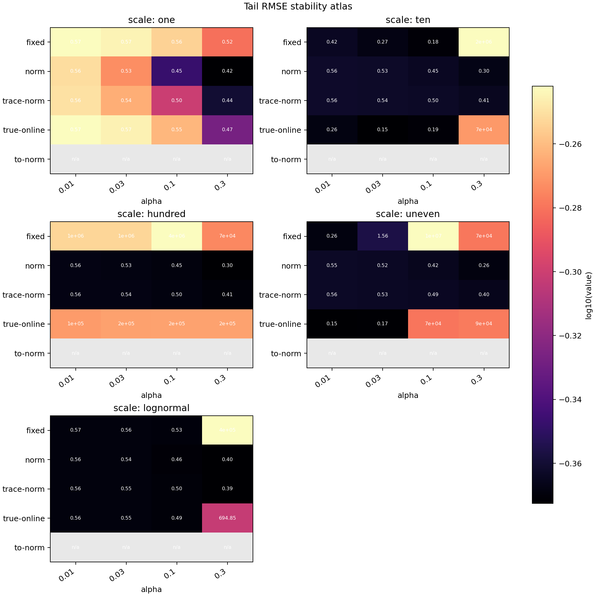
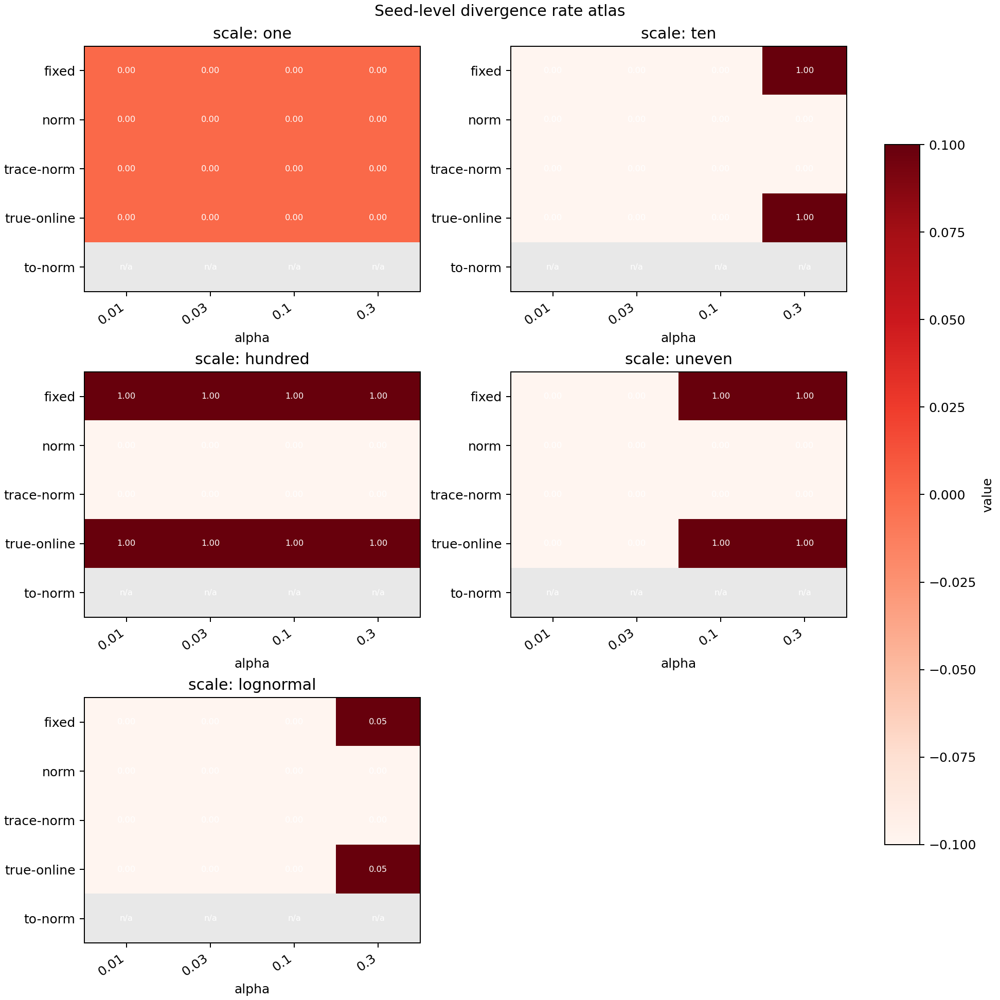
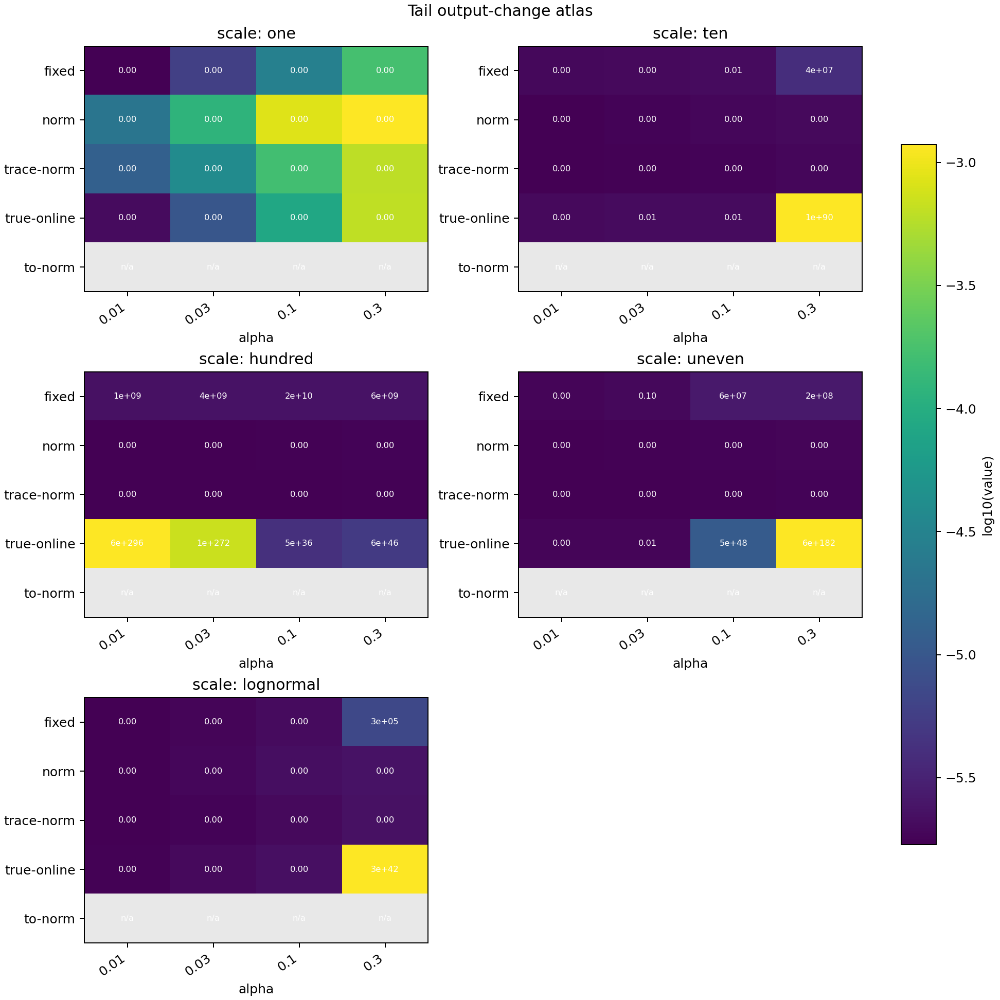
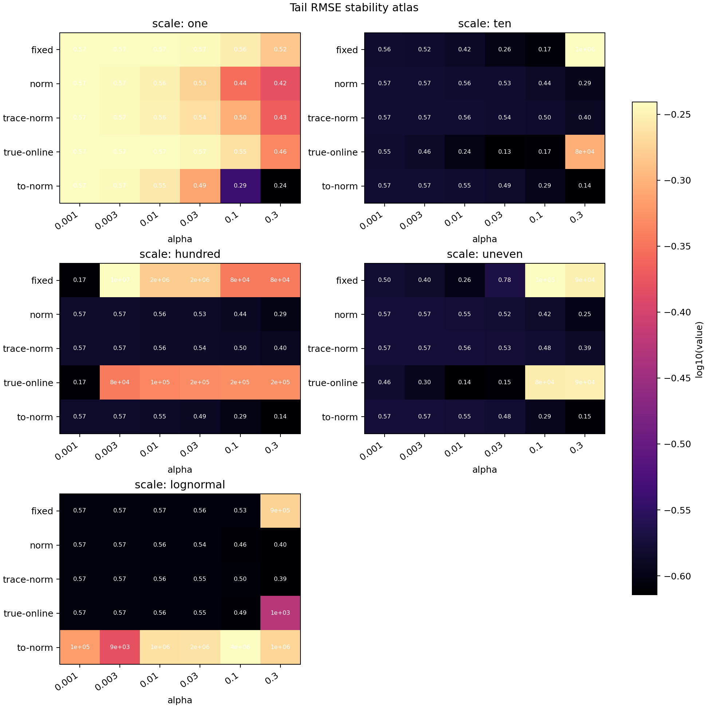
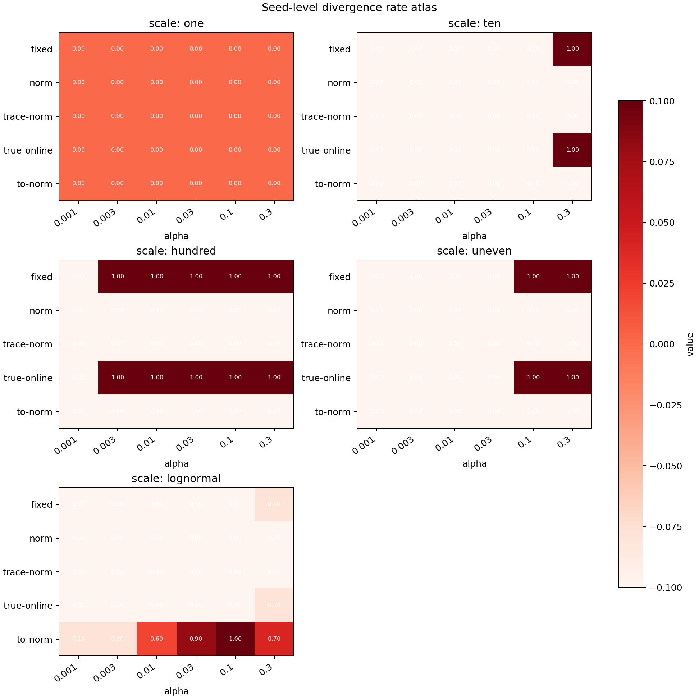
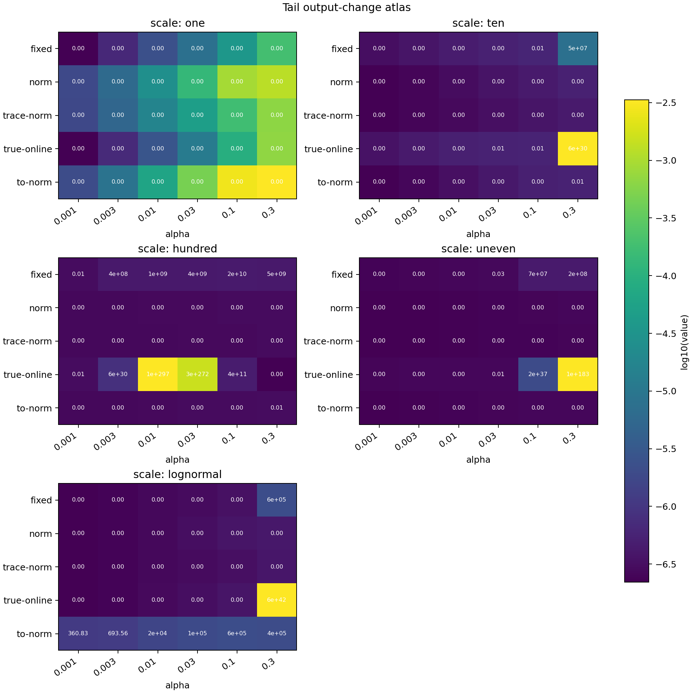

# Output-Controlled TD 中文报告

状态：独立主线 proposal，已经有 20 seeds primary evidence 和 10 seeds true-online fairness-audit evidence。primary result path 是 `experiments/alberta_core_rl/results/output_controlled_td/20260709T051934Z_extended`；fairness-audit result path 是 `experiments/alberta_core_rl/results/output_controlled_td_fairness_audit/20260709T085746Z_extended`。两个 CPU tasks 都写出了标准 artifacts。由于 rjob 结果目录由容器用户创建，普通项目 shell 不能在其中写 figures，因此 report-ready figures 存在本报告目录的 `figures/` 和 `fairness_figures/` 下。

## Abstract

本 proposal 研究 streaming temporal-difference learning 中一个很实际的稳定性问题：固定 parameter step size 并不等价于固定 prediction change。在线性函数逼近中，把 feature 乘以一个常数，概念上的 prediction problem 可以基本不变，但同一个 alpha 对参数和输出的影响会改变几个数量级。我们在 tile-coded random-walk prediction task 中比较 fixed TD、normalized TD、trace-normalized TD(lambda)、raw-alpha true-online TD(lambda) 和 normalized true-online audit variant。20 seeds primary 结果显示非常清晰的稳定性差异：normalized TD 和 trace-normalized TD 在各自 400 个 seed-conditions 中都没有 seed-level divergence；fixed TD 和 raw-alpha true-online TD(lambda) 各有 141/400 个 seed-conditions 发散。10 seeds fairness audit 进一步确认普通 normalized TD 和 trace-normalized TD 在更宽 alpha grid 上保持稳定，而 naive normalized true-online TD(lambda) 虽然移除了 uniform-scale failures，但仍在 lognormal feature scaling 下发散。核心结论不是某个 alpha 在某个 benchmark 上更好，而是 online TD 的更新单位应该更接近 prediction/output effect，而不只是 raw parameter displacement。

## Proposal Template Answers / 提案模板回答

What do we want to understand? 我们想理解 online TD prediction 在每个 transition 只用一次、没有 replay buffer 的 streaming 设置中，能否对 nuisance feature scaling 保持稳定。

What setting or testbed is used? Testbed 是 tile-coded random-walk prediction problem。底层 Markov chain 和目标 value function 固定，但 feature magnitude 被 uniform、uneven 和 lognormal patterns 人为缩放。

What will we examine? 我们比较 fixed-step TD、normalized TD、trace-normalized TD(lambda)、true-online TD(lambda) 和 normalized true-online audit variant，并在 feature scales 和 alpha 网格上观察 stability region，而不是只看一个调好的 alpha。

What will we look at? 主要证据是 RMSE、seed-level divergence、weight norm、prediction-change magnitude 和 effective step size 的 heatmaps/tables。一个方法更强，意味着同一组 alpha 在更多 feature scales 下保持稳定。

## 独立研究范围

本 proposal 是关于 streaming value prediction 中 update units 的独立研究。它隔离 feature-scale invariance problem：底层 random-walk prediction problem 在概念上保持不变，只改变 feature vector 的单位和尺度。reward-origin effects、control behavior 和 model-based planning 不属于本报告范围，因此这里的 claim 限定在线性函数逼近下的 streaming prediction。

本报告也不应被理解为对 true-online TD(lambda) 的一般否定。当前 true-online 条件是 feature-scale stress test 中的 raw-alpha trace baseline。它的 divergence 说明在 feature rescaling 下 raw parameter-space alpha 不公平，而不是说明 true-online TD(lambda) 在合适 tuning 或 normalization 下本质不稳定。

## 证据等级

证据等级：强独立主线候选，主要支持 prediction-side update geometry 机制，并且已经完成 true-online trace baseline 的 fairness audit。完成的 primary CPU run 包含 20 seeds、20000 steps、5 种 feature-scale patterns、4 个 alphas 和 4 个 algorithms。关键 primary result 按 seed-level event 统计：normalized TD 和 trace-normalized TD 在完整网格中没有 divergent seed-condition；fixed TD 和 raw-alpha true-online baseline 各有 141/400 个 seed-conditions 发散。

Fairness audit 使用 10 seeds、150 个 condition groups、5 种 feature-scale patterns、6 个 alphas 和 5 个 algorithms：fixed TD、normalized TD、trace-normalized TD(lambda)、raw-alpha true-online TD(lambda) 和 normalized true-online TD(lambda)。它强化了主机制结论，也让局限更清楚：normalized TD 和 trace-normalized TD 各自 `0/300` divergent seed-conditions；fixed TD 和 raw-alpha true-online TD(lambda) 各自 `81/300`；normalized true-online TD(lambda) 改善到 `34/300`，但这些失败全部集中在 lognormal feature-scale condition。当前证据仍是 prediction-side，不是 control-side，因此不能被读成已经解决 control agent 的 feature-unit drift。

## 论文式贡献与 Claim 边界

本报告的贡献是 streaming TD 在线性函数逼近下的 update-unit study。它把 feature scaling 从 nuisance hyperparameter 问题转化为可测的稳定性问题：alpha 到底指定 raw parameter displacement，还是 intended prediction change？extended result 提供 seed-level stability atlas，并显示 feature normalization 和 trace normalization 可以防止整类 scale-induced divergence。

claim 边界是：这是 prediction-side mechanism result，不是完整 control improvement 结果，也不是对 true-online TD(lambda) 算法家族的公平排名。Primary true-online 条件是 raw-alpha baseline；fairness audit 加入 normalized variant，并显示在 heterogeneous feature scales 下 true-online output control 需要更谨慎的推导。

## Research Motivation

Streaming RL 没有 replay buffer、minibatch 或多次遍历数据带来的稳定化效果。每一步更新都来自当前 transition。如果当前 feature vector 特别大，parameter-space alpha 可能在 agent 看到下一个 correction sample 前就造成巨大的 prediction change。这不是一个表面上的 numerical scaling 问题：Alberta Plan 式的 long-lived agent 可能同时维护许多 value functions、GVFs 和 learned models，而这些 predictions 会依赖不同单位、不同量纲、甚至随时间漂移的 sensory channels。

Alberta Plan 强调 ordinary experience、temporal uniformity、continual value-function learning 和 limited computation。这些约束使得人工为每个 sensor 或每个 value function 手动调 alpha 很不可取。更可扩展的原则是用 update 对 prediction 的预期影响定义更新大小，这与 normalized LMS 和 recent intentional updates for streaming RL 的观点一致。本 proposal 在一个机制最清楚的线性 Core RL 设置中检验这个思想。

## Research Question

Output-controlled 或 normalized TD 能否让 streaming value prediction 对 feature scale 和 trace magnitude 更稳健？

Hypothesis：normalized TD variants 应该比 fixed-step TD 在 feature scales 和 step sizes 上有更大的稳定区域，因为它们的 alpha 更接近控制 output change，而不是 raw parameter movement。

## Alberta Plan Connection

本研究对应 Alberta Plan base agent 中 value-functions component。一个持续 agent 可能从同一条 experience stream 中学习许多 predictions，而这些 predictions 必须在每个 time step 用有限计算在线更新。本 proposal 也对应 temporal uniformity：没有特殊 calibration phase，没有 replay buffer，也没有事后重新缩放 dataset。agent 必须在 experience 到来时立即学习。

## Related Work

最直接的近年动机来自 Intentional Updates for Streaming Reinforcement Learning：在 batch-size-one learning 中，parameter-space step size 会产生不可预测的 output change，因此应先指定 update 的 intended outcome。Normalized LMS 提供了更早的 scale-aware prediction-learning precedent。Streaming Deep RL Finally Works 和 Squeezing More from the Stream 提供 no-replay streaming regime 的背景；本项目为了保持 Core RL 和可解释性，故意停留在线性方法。True Online TD(lambda) 是重要的在线 trace baseline；当前 raw-alpha 实现必须谨慎解释，因为 true-online methods 在合适 step-size 使用下本来是很强的算法。

## Environment

环境是一个较大的 random-walk prediction task，使用 overlapping tile-coded features。agent 在 random policy 下预测到达右终端状态的概率。true values 已知，因此可以在 stream 中定期计算所有 states 上的 RMSE。

Feature-scale conditions 包括 `one`、`ten`、`hundred`、`uneven` 和 `lognormal`。这些条件让 qualitative prediction task 基本不变，但改变 feature vectors 的几何结构。`hundred` 是故意很严苛的 uniform rescaling；`uneven` 和 `lognormal` 让某些维度比其他维度大很多，更接近 multi-sensor setting。

## Methods

Fixed TD 使用常数 alpha，更新方向是 `x_t` 或 `z_t`。Normalized TD 用近似 `epsilon + ||x_t||^2` 的分母缩放 alpha，因此较大的 feature vector 不会自动带来更大的 prediction movement。Trace-normalized TD(lambda) 用 trace norm 做分母，因为 lambda 非零时真正的更新方向是 eligibility trace，而不是当前 feature 本身。True-online TD(lambda) 使用 lambda `0.8`，作为 principled trace method 加入比较。Primary run 把它作为 raw-alpha baseline；fairness audit 加入 normalized true-online variant，用来判断 raw-alpha failure 主要是不是单位不公平。

记录的 `prediction_change` metric 估计更新后当前 prediction 变化了多少。这个指标很关键：一个 update rule 在 parameter space 看起来合理，但在 prediction space 可能已经不稳定。

## Experimental Design

完成的 extended sweep 设置如下：

- result path: `experiments/alberta_core_rl/results/output_controlled_td/20260709T051934Z_extended`;
- CPU task: `core-rl-output-extended-fixed-46602102`;
- seeds: `0-19`;
- 每个 seed-condition steps: `20000`;
- representation: tile coding;
- feature scales: `one`, `ten`, `hundred`, `uneven`, `lognormal`;
- alphas: `0.01`, `0.03`, `0.1`, `0.3`;
- algorithms: fixed TD, normalized TD, trace-normalized TD(lambda), raw-alpha true-online TD(lambda);
- lambda: trace-normalized 和 true-online variants 使用 `0.8`，其他为 `0`。

决策标准不只是最低 RMSE。一个更适合 streaming 的 update 应该在 nuisance feature-unit changes 下保持稳定。因此 divergence 按 seed-level event 评价：只要某个 seed-condition 任意 logged row 中出现 `diverged = 1`，该 seed-condition 就记为 diverged。

完成的 fairness audit 使用 result path `experiments/alberta_core_rl/results/output_controlled_td_fairness_audit/20260709T085746Z_extended`，CPU task 是 `core-rl-output-fairness-extended-rerun-29576456`，seeds `0-9`，每个 seed-condition `30000` steps，feature scales 为 `one`、`ten`、`hundred`、`uneven` 和 `lognormal`，alphas 为 `0.001`、`0.003`、`0.01`、`0.03`、`0.1` 和 `0.3`，算法为上述五类。它是 fairness 和 failure-mode audit，不替代 primary 20-seed run。

## 实验设计依据

random-walk prediction task 故意比 control benchmark 简单，因为研究问题是 update geometry。已知 true value function 允许直接测量 RMSE；tile coding 提供 overlapping linear features，使 feature norms 和 trace norms 真正影响学习动态。这个设计可以区分 prediction error、raw weight movement 和 actual output change 三个机制。

scale conditions 本身不是现实 sensor model，而是 invariance tests。uniform scaling 检查同一个 represented prediction 在不同单位下是否还能学习；uneven 和 lognormal scaling 检查少数大 feature components 是否会主导 streaming update。alpha grid 用来展示 stability boundary，不是为了选一个 tuned alpha。因此正确主图是 stability atlas 和 divergence table，而不是 single final-RMSE leaderboard。

## Results







| Algorithm | Lambda | Seed-conditions diverged | Non-diverged final RMSE mean | Interpretation |
|---|---:|---:|---:|---|
| fixed TD | 0.0 | `141/400` (`35.2%`) | `0.551` | easy scales 下可用，但对 feature scale 极其敏感。 |
| normalized TD | 0.0 | `0/400` (`0.0%`) | `0.461` | 所有测试 scale 和 alpha 下都稳定。 |
| trace-normalized TD(lambda) | 0.8 | `0/400` (`0.0%`) | `0.497` | 带 traces 时，如果 normalize trace direction，也能保持稳定。 |
| true-online TD(lambda), raw alpha | 0.8 | `141/400` (`35.2%`) | `0.382` | 在 surviving easy conditions 上 RMSE 低，但很多 high-scale conditions 发散。 |

Fixed TD 在 scale `hundred` 的所有 alpha 下所有 seeds 都发散，在 scale `ten` 的 alpha `0.3` 下发散，在 scale `uneven` 的 alpha `0.1` 和 `0.3` 下发散。它在 `lognormal` alpha `0.3` 下也有小但真实的 divergence rate。

Normalized TD 在完整网格中没有任何 seed-level divergence。Scale `hundred` 下，它在 alpha `0.01`、`0.03`、`0.1`、`0.3` 的 final RMSE 约为 `0.56`、`0.53`、`0.44`、`0.28`。Trace-normalized TD(lambda) 也没有 divergence；在 scale `hundred` 下，final RMSE 约为 `0.56`、`0.54`、`0.49`、`0.40`。

Raw-alpha true-online TD(lambda) baseline 需要谨慎解读。它和 fixed TD 的 diverged seed-condition 数量相同，包括所有 `hundred` conditions；但它在未发散条件下 RMSE 很低，因为 surviving conditions 多数是更容易的 scale settings。因此这是一条关于公平 step-size comparison 的警示，不是对 true-online TD(lambda) 本身的否定。

### 第二轮 Fairness Audit

Fairness audit 是同一研究问题内部完成的第二个实验。它加入 normalized true-online TD(lambda) variant，并扩大 alpha/scale grid，避免把 raw-alpha trace baseline 当成 true-online TD(lambda) 的最终评价。它也改进了图表呈现：报告中优先使用 per-scale panel heatmaps，而不是单张非常宽的 atlas，因为宽 atlas 适合 audit，但在论文式 PDF 中会被压得太矮。

Extended result path：`experiments/alberta_core_rl/results/output_controlled_td_fairness_audit/20260709T085746Z_extended`

CPU task：`core-rl-output-fairness-extended-rerun-29576456`，已在 2026-07-09 17:41 HKT 成功完成。







| Algorithm | Lambda | Fairness-audit seed-conditions diverged | Main interpretation |
|---|---:|---:|---|
| fixed TD | 0.0 | `81/300` (`27.0%`) | 大 uniform feature scale 和 high-alpha uneven/ten-scale settings 下失败。 |
| normalized TD | 0.0 | `0/300` (`0.0%`) | 本 prediction audit 的所有测试 scales 和 alphas 下稳定。 |
| trace-normalized TD(lambda) | 0.8 | `0/300` (`0.0%`) | trace-normalized update direction 在更宽网格下仍稳定。 |
| true-online TD(lambda), raw alpha | 0.8 | `81/300` (`27.0%`) | 在 feature-scale stress 下与 fixed TD 的 seed-level failure count 相同。 |
| true-online TD(lambda), normalized audit | 0.8 | `34/300` (`11.3%`) | 移除了 uniform-scale failures，但仍在 lognormal feature scaling 下失败，因此 naive normalization 不是完整 true-online answer。 |

## Analysis

Heatmaps 支持核心机制：当 feature scale 改变时，fixed alpha 不是一个好的 streaming prediction progress 单位。在 large 或 uneven scales 下，同一个 TD error 可能仅仅因为 feature vector 更大而产生巨大 output change。Normalized TD 改变 update 的分母，使 feature direction 变大时 effective step size 收缩。Trace-normalized TD 把同一思想应用到 accumulated eligibility trace。

结果也说明为什么只做 one-alpha leaderboard 会误导。True-online TD(lambda) 有强理论和以往经验支持，但当实验操控的是 feature magnitude 时，用 raw-alpha true-online baseline 去和 normalized methods 比较并不公平。完成的 fairness audit 显示 simple normalized true-online variant 确实修复了 harsh uniform-scale failures，但它不是 universal repair：lognormal feature scaling 仍可能产生 trace-correction/output-control interaction，而 ordinary normalized TD 和 trace-normalized TD(lambda) 在本 testbed 中避免了这些失败。

## 局限与有效性威胁

当前任务是 prediction-only。这让 feature-scale mechanism 很干净，但如果要说明 control 侧也受益，需要在 Sarsa 或 actor-critic 中做进一步实验。

Feature scaling 是 synthetic 的。这适合做 invariance test，但真实 sensor streams 可能有 drifting scale、changing relevance 和 partial observability。最重要的下一步是做 no-reset feature-scale switch。

Divergence 现在使用 seed-level event rate，比 logged-row average 更可解释；但 final RMSE 仍然是最后 logged point，而不是 area-under-learning-curve。未来分析应同时报告 stability 和 learning speed。

## Reviewer Critique And Revisions

Strict Core-RL reviewer：random-walk prediction task 可能看起来太 toy。回应：最终实验使用 overlapping tile coding、5 种 feature-scale patterns、20 seeds 和 4-by-5 scale/alpha stress grid。环境简单是因为问题是 update geometry，而不是复杂行为。

Function-approximation reviewer：true-online TD(lambda) 不应被不公平比较。回应：报告现在明确把 primary condition 称为 raw-alpha baseline，并加入 completed normalized true-online fairness audit。这个 audit 改进了解释，而不是给 true-online TD(lambda) 一个笼统通过：naive normalized true-online TD(lambda) 仍在 lognormal feature scaling 下失败。

Reproducibility reviewer：CPU job 之前看起来像卡住，因为旧 runner 只有整个 sweep 结束才写结果。回应：job 已成功完成；后续 Output-Controlled TD runs 已加入 condition-level progress log。本报告也记录 rjob ownership 问题，并把 figures 存在 report folder。

逐 proposal 审查矩阵：

| 审查角度 | 批评 | 已处理 | 剩余风险 |
|---|---|---|---|
| Core RL | random walk 可能显得太简单。 | 使用 tile coding、feature-scale stress、seed-level divergence 和 known-value RMSE 隔离 update-unit mechanism。 | 仍需 Sarsa 或 actor-critic control transfer。 |
| Function approximation | raw-alpha true-online TD(lambda) 不是公平最终 baseline。 | 加入 normalized true-online fairness audit，并避免泛化否定 true-online TD(lambda)。 | 仍需要更 principled 的 true-online output-control derivation 和 max-stable-alpha analysis。 |
| Streaming learning | 每个 run 固定 scale 弱于 sensor drift。 | 当前结论限定为 fixed-condition invariance。 | 需要 no-reset feature-scale switch。 |
| 统计 | logged-row divergence 会夸大长 run。 | 使用 seed-level divergence events。 | 仍可补 time-to-divergence 和 AUC。 |
| 严格老师 | 报告应回答问题，而不是说 normalized TD 赢了。 | 主 claim 是 output-controlled update units 在 nuisance feature scaling 下保持稳定性。 | 若作为最终项目，还需更紧密连接 downstream control。 |

## Conclusion

Extended evidence 支持本 proposal 的主要观点：streaming TD 应该控制 prediction space 中的 update consequence，而不仅仅是 raw parameter movement。Normalized TD 和 trace-normalized TD(lambda) 在 primary run 和 fairness audit 的所有测试 feature scales 与 alphas 下稳定，而 fixed TD 在 scale stress 下非常脆弱。Fairness audit 收紧了 true-online interpretation：raw-alpha true-online TD(lambda) 不是公平最终比较，但 naive normalized true-online TD(lambda) 在 lognormal feature scaling 下也不是完整解决方案。

## Reproduction / 复现

```bash
cd /mnt/shared-storage-user/yupeng/Core-RL

PYTHONNOUSERSITE=1 MPLCONFIGDIR=/mnt/shared-storage-user/yupeng/Core-RL/.mplconfig \
  /data/yupeng/conda_envs/core-rl/bin/python experiments/alberta_core_rl/scripts/run_experiment.py \
  --config experiments/alberta_core_rl/configs/output_controlled_td/config_extended.json
```

当前 extended evidence 使用的 CPU-task 命令：

```bash
cd /mnt/shared-storage-user/yupeng/Core-RL

PARTITION=safethm_cpu_task CPU=8 MEM=16000 \
  bash experiments/alberta_core_rl/scripts/run_cpu_task.sh \
  core-rl-output-extended-fixed \
  "PYTHONNOUSERSITE=1 python experiments/alberta_core_rl/scripts/run_experiment.py --config experiments/alberta_core_rl/configs/output_controlled_td/config_extended.json"
```

由于 rjob 结果目录不可写，报告图表生成到 report folder：

```bash
PYTHONNOUSERSITE=1 MPLCONFIGDIR=/mnt/shared-storage-user/yupeng/Core-RL/.mplconfig \
  python experiments/alberta_core_rl/scripts/plot_report_figures.py \
  --kind output-td \
  --result-dir experiments/alberta_core_rl/results/output_controlled_td/20260709T051934Z_extended \
  --figure-dir final/reports/proposals/output_controlled_td/figures
```

Fairness audit extended command：

```bash
PYTHONNOUSERSITE=1 MPLCONFIGDIR=/mnt/shared-storage-user/yupeng/Core-RL/.mplconfig \
  /data/yupeng/conda_envs/core-rl/bin/python experiments/alberta_core_rl/scripts/run_experiment.py \
  --config experiments/alberta_core_rl/configs/output_controlled_td_fairness_audit/config_extended.json
```

Fairness audit figure command：

```bash
PYTHONNOUSERSITE=1 MPLCONFIGDIR=/mnt/shared-storage-user/yupeng/Core-RL/.mplconfig \
  /data/yupeng/conda_envs/core-rl/bin/python experiments/alberta_core_rl/scripts/plot_report_figures.py \
  --kind output-td \
  --result-dir experiments/alberta_core_rl/results/output_controlled_td_fairness_audit/20260709T085746Z_extended \
  --figure-dir final/reports/proposals/output_controlled_td/fairness_figures
```
