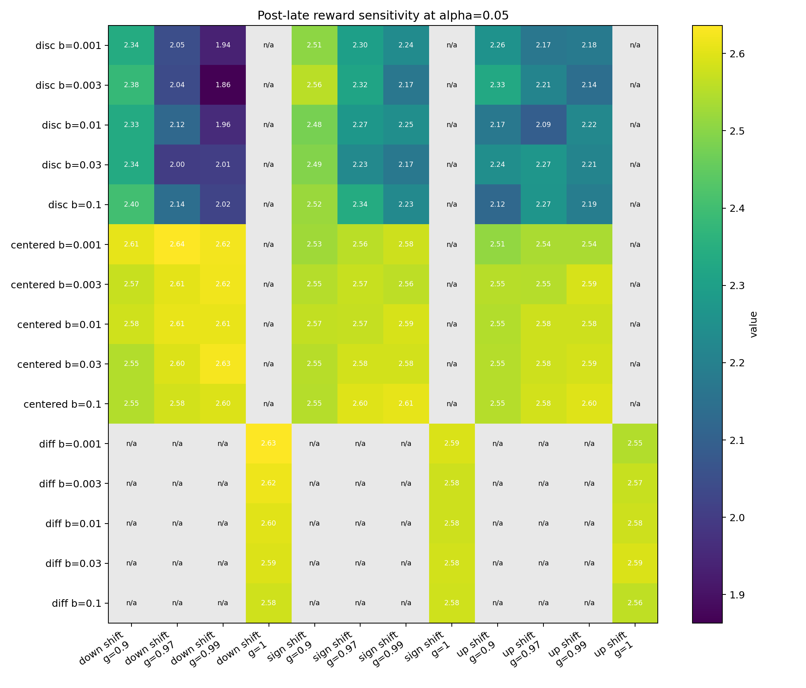
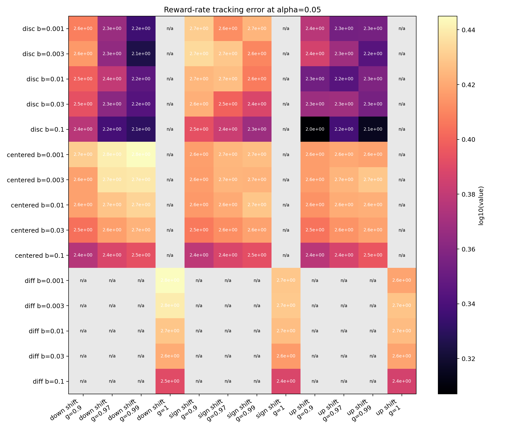
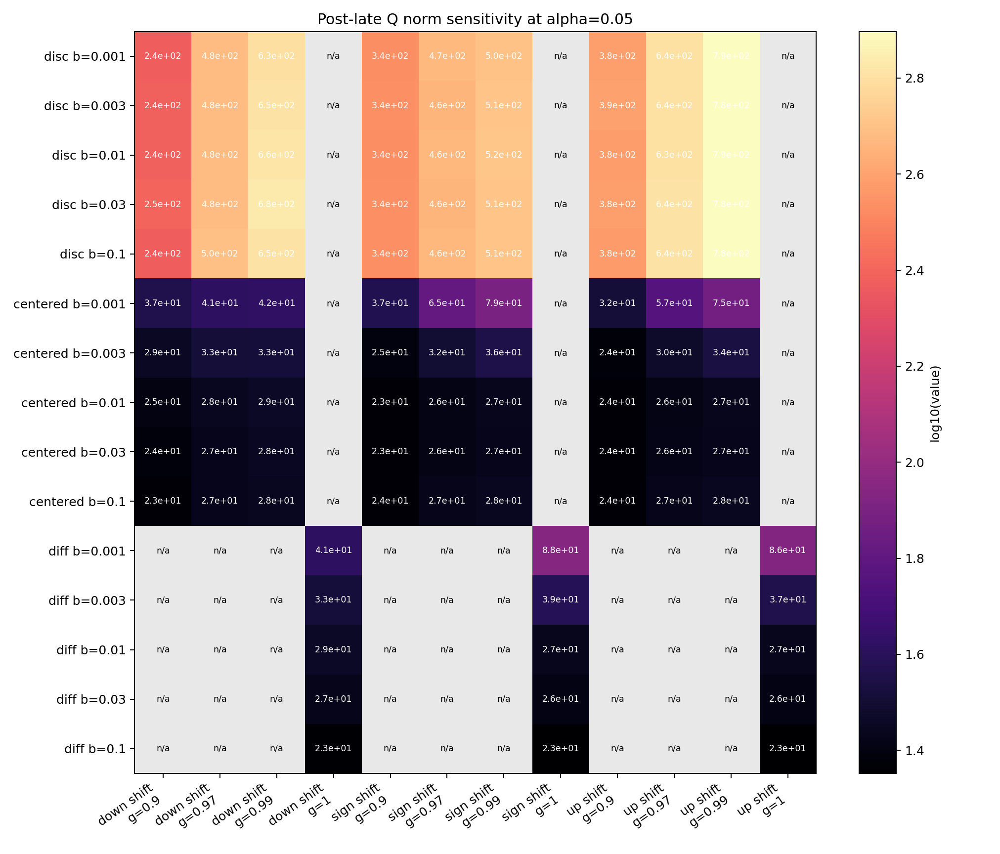
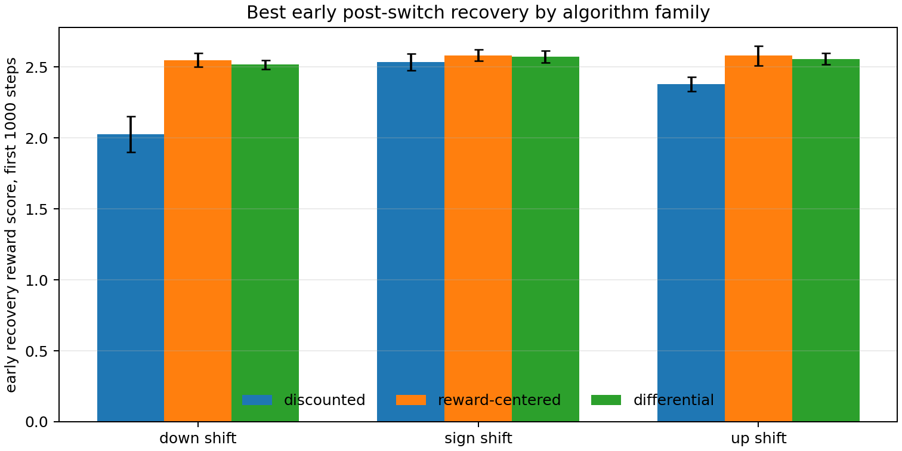
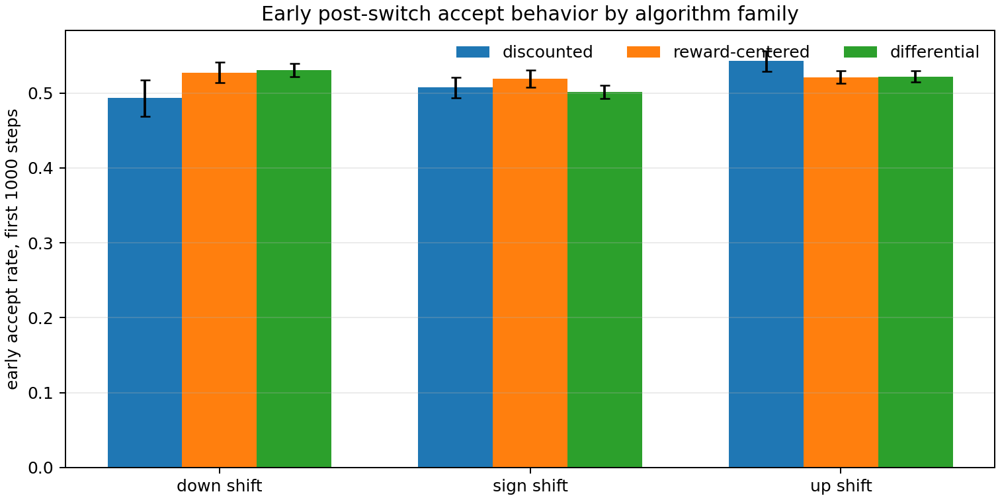

# Reward-Centered Continuing Sarsa 中文报告

英文对应报告：`report.md`

状态：独立主 proposal，已完成 20 seeds、20000 steps 的 reward-shift / alpha extended sweep，并已完成 beta/gamma/no-reset reward-origin switch sweep。最强 claim 是 access-control continuing stream 中的 reward-origin invariance 和 value-scale control，而不是 reward centering 的 universal solution。

## 摘要

本课题研究 continuing reinforcement learning 中一个非常基础但容易被忽略的 invariance 要求：在 continuing control task 中，如果给所有 reward 加上同一个常数，任务相关行为原则上不应改变。普通 discounted action-value learning 并不自动满足这个要求，因为 reward offset 会进入 TD error 和 action values 的尺度，尤其当 gamma 接近 1 时，常数 reward shift 会积累成很大的 value offset。本课题在 access-control queue 中比较 discounted Sarsa、reward-centered Sarsa 和 differential Sarsa，检验 online reward centering 是否能减少任意 reward zero-point 带来的学习敏感性。extended 结果显示，discounted Sarsa 的 Q norm 会随着 reward shift 和 alpha 显著膨胀，而 reward-centered 和 differential variants 能保持更稳定的 value scale 和 unshifted reward。本研究不是比较“哪个算法分数更高”，而是问一个 continuing agent 能否用不依赖任意 reward baseline 的单位学习。

## 独立研究总结

本研究测试 continuing control 中的 reward-shift invariance。RL 问题是 access-control queue：agent 观察服务器空闲数量和当前 customer priority，然后持续在线决定 accept/reject，不存在离线训练阶段或 replay buffer。实现的方法是 discounted Sarsa、reward-centered Sarsa 和 differential Sarsa，均使用 tabular/linear action values。实验改变 constant reward shifts，并记录 unshifted reward、accept behavior、high-priority acceptance、reward baseline、TD error 和 Q norm。固定 reward-origin 的主证据来自 20 seeds、20000 steps 的 alpha sweep：ordinary discounted Sarsa 会产生明显依赖 reward shift 的 value scale，而 centered 和 differential variants 在 value norm 与 unshifted reward 上更稳定。已经完成的第二轮实验进一步测试同一条 continuing stream 内的 no-reset reward-origin switch、beta/gamma sensitivity 和 switch direction，并在当前 access-control setting 中加强同一机制 claim：centered 与 differential variants 能保持较高 post-late reward，而 discounted Sarsa 可能携带很大的 nuisance value scale。

## Proposal Template Answers / 提案模板回答

Focused RL question：在 online continuing control task 中，agent 是否能学习到对 arbitrary constant reward shift 不敏感的 action values 和行为？这个问题不是问 reward-centered Sarsa 的 shifted return 是否最高，而是问学习动态是否满足 average-reward continuing problem 中应有的 reward-origin invariance。

Setting / testbed：testbed 是经典 access-control queue。它比 two-state diagnostic 更有意义，因为它有 state-dependent action feasibility、priority-dependent rewards 和 accept/reject control tradeoff；同时它仍足够小，可以审计 TD error、value norm、reward baseline 和 policy probes。

Implemented comparison：实验比较 discounted Sarsa、reward-centered Sarsa 和 differential Sarsa，所有方法都从单条 online stream 学习，不使用 replay buffer 和 deep network。第一组完成 sweep 改变 reward shift 和 alpha；第二组完成 sweep 改变 beta、gamma、alpha、switch direction，并在同一条 stream 中途改变 reward origin，不重置 learner。

Metric / figure：主证据必须同时包括 unshifted reward、Q norm、high-priority acceptance 和 divergence。只有当 centered methods 保持行为并防止 value-scale inflation 时，才算支持 hypothesis；只看 reward 的表格无法回答 invariance question。

Compute need / fallback：两个 CPU-scale sweeps 都已完成。诚实 fallback 不再是“switching remains future work”；当前主要限制变成该 switch experiment 仍是 controlled access-control stream，还没有 full statewise policy-distance probes 或更大的 continuing tasks。

## 独立研究范围

本 proposal 是关于 continuing control 中 reward-origin invariance 的独立研究。它不声称解决所有 average-reward learning、reward shaping 或 nonstationarity；范围更窄也更清楚：constant reward translation 不应该迫使 access-control Sarsa 重新调 step size、不应该造成任意 value-scale expansion，也不应该改变 accept/reject behavior。

本研究同时包含 mechanism-level measurements 和 control-level measurements。value-scale、TD-error、reward-baseline、policy-probe 和 accept-rate diagnostics 共同构成本研究对 reward-origin invariance claim 的证据链。

## 证据等级

证据等级：强独立主线候选，已有两个 completed sweeps。Fixed-condition result 包含 20 seeds、每个 condition 20000 online steps、5 个 reward shifts、3 个 alphas 和 3 个 algorithms。No-reset switch result 使用 10 seeds、20000 online steps、1575 condition groups 和 8,112,150 logged rows。两组证据共同支持：ordinary discounted Sarsa 对 reward origin 敏感，而 centered/differential variants 在 fixed-origin 和 midstream reward-origin switch settings 中都明显更稳健。

证据仍有边界。Switch sweep 说明 controlled reward-origin changes 下可以 post-switch recovery，但没有证明单个 beta 或 gamma 普遍最优，也还没有全状态 policy-distance probes。因此最终 claim 仍应保持为 invariance 和 value-scale claim，而不是 reward centering 解决所有 nonstationary continuing control 的一般定理。

## 论文式贡献与 Claim 边界

本报告的贡献是 continuing control 中 reward-origin sensitivity 的受控 invariance analysis。它把 reward origin 从一个看似工程细节的问题写成 Core RL 问题，使用可解释的 access-control queue 作为 continuing testbed，并且把任务真实的 unshifted reward 与 learner 看到的 arbitrary shifted reward 分开。最重要的经验贡献不是某个表格中 reward-centered Sarsa 分数更高，而是 centered/differential updates 在 reward translation 下同时保持 value scale、TD-error scale 和行为更稳定。

同样重要的是 claim 边界。本报告没有证明 reward centering 总是优于 differential methods，也没有证明一个 beta 能适应所有 nonstationarity。更严谨的结论是：在当前 tested access-control streams 中，average-reward-style removal of reward offsets 是唯一持续产生 practical reward-origin invariance 的测试设计族；ordinary discounted Sarsa 会编码一个很大的 nuisance value component。

## 研究动机

Alberta Plan 把智能体看作在 temporally uniform experience stream 中持续行动和持续学习的系统，而不是在 episodic benchmark 中反复 reset 的训练器。在这种设定下，reward origin 是一个很干净的压力测试：如果所有 reward 都平移同一个常数，average-reward continuing task 的 policy preference 不应该改变。长期运行的 agent 不应该因为工程师重新定义 reward sensor 的零点，就需要重新调 step size 或换 representation。

普通 discounted value methods 会破坏这种 practical invariance。gamma 接近 1 时，常数 reward shift 会给 value function 增加一个很大的常数分量；这个分量对 action choice 几乎没有任务信息，却会改变 TD-error magnitude、value norm，并通过 finite step-size effects 影响学习动态。Reward centering 有吸引力，是因为它小、在线、符合课程约束：不需要 replay buffer，不需要 deep network，也不需要 offline fitting。

## 研究问题

核心问题是：online reward centering 是否能让 Sarsa 在 non-episodic continuing control task 中对 constant reward shifts 更稳健？

具体假设是：与 ordinary discounted Sarsa 相比，reward-centered Sarsa 和 differential Sarsa 应该在不同 reward shifts 下表现出更低的 value-scale variation，并保持更稳定的 unshifted task reward。

这个假设关注 invariance 和 learning dynamics，而不是 shifted observed reward 的绝对值。因此所有主要结果都把 learner 看到的 shifted reward 和评价用的 unshifted reward 分开记录。

## Alberta Plan 关联

本课题对应 Alberta Plan 中几个核心主题：continuing problems 而不是 episodic reset tasks；value functions 作为 agent prediction/control 的核心对象；average-reward thinking；从 ordinary experience 中在线适应；用小机制减少 hand-tuned scales 的敏感性。环境和方法刻意保持在 Core RL 范围内，目的是让 value-scale failure 可以被解释，而不是用大模型把机制问题遮住。

## 相关工作

主要参考是 Reward Centering，它说明 subtracting empirical average reward 可以改善 continuing discounted methods 并减少 constant reward-shift sensitivity。Average-reward RL 和 access-control queue 提供了经典 setting。Bellman Error Centering 给出了相关 centered fixed points 的理论视角。Alberta Plan 提供了 continuing agents 和 temporal uniformity 的总体动机。相关本地资料包括 `resources/alberta_plan_related/reward_centering_2405.09999.pdf`、`resources/alberta_plan_related/bellman_error_centering_2502.03104.pdf`、`resources/alberta_plan_related/average_reward_learning_planning_2006.16318.pdf` 和 `resources/alberta_plan_related/alberta_plan_2208.11173.pdf`。

## 环境设计

主环境是 access-control queue。状态包含 free servers 数量和当前 customer priority；动作是 reject 或在 server available 时 accept。unshifted reward 是被接受 customer 的 priority，拒绝或无 server 时为 0。实验中 learner 看到的 reward 是 `observed_reward = unshifted_reward + reward_shift`。这样我们可以构造多个等价的任务描述：任务真实偏好不变，但 reward zero-point 改变。agent 必须在单条 online stream 中学习，没有 replay，没有离线训练，没有 train/test 分割。

这个环境比 two-loop toy 更合适，因为它是 continuing average-reward 风格，有状态分布、accept/reject tradeoff 和 high-priority policy probe；同时它仍然足够小，可以清楚检查 Q norm、reward_bar、TD error 和 policy probes。

## 方法

实验比较三个 on-policy control agents：discounted Sarsa 使用 gamma `0.99`；reward-centered discounted Sarsa 使用 online average-reward estimate；differential Sarsa 使用 gamma `1.0` 和 average-reward correction。所有方法都使用 one-hot state features、epsilon-greedy behavior，并且每个 environment step 只做一次在线更新。

普通 discounted Sarsa 的 TD error 是 `delta = R_{t+1} + gamma Q(S_{t+1}, A_{t+1}) - Q(S_t, A_t)`。Reward-centered Sarsa 使用 `delta = (R_{t+1} - r_bar_t) + gamma Q(S_{t+1}, A_{t+1}) - Q(S_t, A_t)`，其中 `r_bar <- r_bar + beta (R_{t+1} - r_bar)`。Differential Sarsa 使用 average-reward form：`delta = R_{t+1} - r_bar_t + Q(S_{t+1}, A_{t+1}) - Q(S_t, A_t)`，并从同一条 continuing stream 中更新 reward baseline。

## 实验设计

当前 extended sweep 使用 access-control queue，reward shifts 为 `-8, -4, 0, 4, 8`，alpha 为 `0.02, 0.05, 0.1`，seeds 为 `0-19`，每个 condition 运行 `20000` online steps。比较方法为 discounted Sarsa、reward-centered Sarsa 和 differential Sarsa。结果路径是 `experiments/alberta_core_rl/results/reward_centered_sarsa/20260709T024517Z_extended`。

主要指标包括 unshifted average reward、Q norm、TD-error scale、reward-bar estimate、accept rate 和 policy probes。判断标准不是某个 shifted reward 更高，而是一个方法是否能在不同 reward shifts 下保持 unshifted reward 和 policy probes，同时让 Q norm 和 TD-error scale 近似 invariant。一个方法如果需要为每个 reward shift 单独调 alpha，或者 value norm 因任意 reward offset 膨胀，就不能算解决 continuing reward-origin 问题。

第二轮 sensitivity extension 已经实现并完成为 `reward_centered_sarsa_sensitivity`。它包含 beta values `0.001, 0.003, 0.01, 0.03, 0.1`，discounted/centered variants 的 gamma sweep，以及同一条 stream 中途切换 reward origin、不重置 weights 的 nonstationary extension。Extended result path 是 `experiments/alberta_core_rl/results/reward_centered_sarsa_sensitivity/20260709T085747Z_extended`，已经写出标准 artifacts。下面的 compact table 是 dense sensitivity heatmaps 的主要阅读入口；figures 使用 completed extended result，divergence heatmap 不作为主图，因为所有 conditions 都是 zero divergence，关键 failure 是 value-scale inflation 而不是 numerical crash。

| Switch type | Best reward-centered condition | Best differential condition | Best discounted condition | Weak discounted condition | Interpretation |
|---|---|---|---|---|---|
| Down-shift | `alpha=0.05`, `beta=0.001`, `gamma=0.97`: reward `2.636 +/- 0.028`, Q `41.1` | `alpha=0.05`, `beta=0.001`: reward `2.634 +/- 0.016`, Q `41.1` | `alpha=0.1`, `gamma=0.9`: reward `2.447 +/- 0.031`, Q `263.8` | `alpha=0.02`, `gamma=0.99`: reward `1.581 +/- 0.221`, Q `290.6` | Centering 和 differential updates 能恢复高 reward；discounted Sarsa 对 gamma 和 alpha 敏感。 |
| Sign-shift | `alpha=0.05`, `beta=0.1`, `gamma=0.99`: reward `2.609 +/- 0.027`, Q `28.0` | `alpha=0.05`, `beta=0.001`: reward `2.592 +/- 0.025`, Q `87.9` | `alpha=0.1`, `gamma=0.9`: reward `2.580 +/- 0.037`, Q `480.4` | `alpha=0.1`, `gamma=0.99`: reward `1.834 +/- 0.256`, Q `862.5` | Discounted Sarsa 只有在有利设置下才能接近 reward，并且 value scale 大得多。 |
| Up-shift | `alpha=0.1`, `beta=0.03`, `gamma=0.99`: reward `2.606 +/- 0.027`, Q `32.3` | `alpha=0.1`, `beta=0.03`: reward `2.598 +/- 0.017`, Q `30.0` | `alpha=0.1`, `gamma=0.9`: reward `2.410 +/- 0.065`, Q `507.1` | `alpha=0.05`, `gamma=0.97`: reward `2.093 +/- 0.129`, Q `634.1` | Reward centering 避免把 positive offset 储存成巨大的 action-value component。 |







新增 recovery-AUC follow-up 直接从同一个 completed sensitivity run 的 `metrics.csv` 中分析，而不是重新运行一个更小 pilot。对每个 seed 和 condition，early recovery score 定义为 reward-origin switch 后前 `1000` 个 logged steps 中 `avg_unshifted_reward` 的平均值。这个视角比 post-late table 更严格，因为它问的是：reward sensor 改变且 learner 不重置之后，哪个 algorithm family 能更快恢复有用任务 reward，同时不携带很大的 arbitrary value offset？





| Switch type | Discounted best early score / Q norm | Reward-centered best early score / Q norm | Differential best early score / Q norm | Interpretation |
|---|---|---|---|---|
| Down-shift | `2.025 +/- 0.126` / `480.7` | `2.549 +/- 0.049` / `24.7` | `2.517 +/- 0.032` / `23.5` | Centered 和 differential methods 在保持小 value scale 的同时恢复更多 reward。 |
| Sign-shift | `2.535 +/- 0.060` / `88.4` | `2.583 +/- 0.041` / `59.9` | `2.573 +/- 0.043` / `85.9` | Discounted Sarsa 在有利 gamma 下可以恢复 early reward，但 value scale 仍更大。 |
| Up-shift | `2.378 +/- 0.050` / `183.0` | `2.580 +/- 0.068` / `76.5` | `2.557 +/- 0.039` / `33.7` | Positive-offset switch 最清楚暴露 nuisance-value problem。 |

## 实验设计依据

环境、变量和指标用于拆开三个容易被混淆的解释。第一，unshifted reward 和 high-priority acceptance 测试任务行为，而不是 learner 看到的 shifted scalar reward。第二，Q norm 和 TD-error scale 测试 learner 是否把任意 reward offset 编码成巨大的 value component。第三，divergence 和 policy probes 测试这种影响是否只是数值外观，还是会改变实际 control。因此 access-control queue 在这里不是 leaderboard benchmark，而是用来测量 reward-origin invariance 的 controlled continuing system。

当前 grids 是有针对性的，不是 blind hyperparameter search。reward shifts `-8` 到 `8` 相对于 access-control priority 足够大，可以给 nuisance value offset 施压。alpha grid 同时包含 ordinary Sarsa 可学习的设置和 value-scale inflation 明显的设置。Sensitivity extension 针对三个因果缺口：beta 决定 baseline lag，gamma 决定 discounted offset amplification，midstream shift 检查不重置 weights 的 continual recovery。

## 结果

下面的报告图使用 seed-tail condition summaries，而不是把所有 learning curves 挤在一张图里。它们分别展示 reward、value scale、行为倾向和 divergence，因此更适合支撑 reward-origin invariance 的结论。


核心结果是更大 seed/alpha sweep 下的 value-scale invariance。Discounted Sarsa 的 Q norm 随 reward shift 和 alpha 强烈增长：在 shift `8`、alpha `0.1` 时，tail Q norm 约 `1875.55 +/- 38.4`，unshifted reward 约 `1.697 +/- 0.147`。这个大 value scale 并不是有用任务知识，而主要是 shifted reward stream 引入的任意 offset。

Reward-centered Sarsa 的 Q norm 小得多，在当前 reward shifts 和 alphas 下大致为 `22-35`，并且没有 divergence。它的 unshifted reward 基本保持在 `2.55-2.60`。Differential Sarsa 也表现出类似的 scale-stability pattern，unshifted reward 约为 `2.55-2.61`，Q norm 也保持在较小范围。ordinary discounted Sarsa 在较大的正负 shifts 和较高 alpha 下明显退化。

完成的 no-reset sensitivity sweep 进一步加强 continual-learning claim。它在 `experiments/alberta_core_rl/results/reward_centered_sarsa_sensitivity/20260709T085747Z_extended` 写出标准 artifacts，包含 10 seeds、20000 steps 和 1575 condition groups。所有 conditions 都没有记录 divergence。Post-late 结果显示 reward-centered Sarsa 在 beta/gamma/switch settings 中保持较高表现：down-shift 最佳 post-late average unshifted reward 是 `2.6364 +/- 0.0280`，来自 reward-centered Sarsa `alpha=0.05`、`beta=0.001`、`gamma=0.97`；sign-shift 最佳是 reward-centered Sarsa `alpha=0.05`、`beta=0.1`、`gamma=0.99`，mean `2.6089 +/- 0.0274`；up-shift 最佳是 reward-centered Sarsa `alpha=0.1`、`beta=0.03`、`gamma=0.99`，mean `2.6057 +/- 0.0273`。Differential Sarsa 是接近的 average-reward baseline，最佳 down-shift condition 为 `2.6338 +/- 0.0155`。Discounted Sarsa 在 down-shift 下更不稳健，一个较差 post-late condition 只有 `1.5814 +/- 0.2210`。

Recovery analysis 提供了更严格的 early-window 视角。在 switch 后前 `1000` 个 logged steps 内，最佳 reward-centered condition 在 down-shift、sign-shift 和 up-shift 中分别达到 early recovery score `2.549 +/- 0.049`、`2.583 +/- 0.041` 和 `2.580 +/- 0.068`。对应的最佳 discounted scores 分别是 `2.025 +/- 0.126`、`2.535 +/- 0.060` 和 `2.378 +/- 0.050`。Discounted Sarsa 在有利 gamma 下可以在 sign-shift reward 上接近 centered variant，但其 early Q norm 仍更大。Down-shift 和 up-shift 的结果加强了核心机制 claim：centering 不只是 late value-scale fix，它也能在 no-reset adaptation 的早期保留有用 task reward。

Accept-behavior recovery figure 是对 reward-only 叙事的检查。Down-shift 中，reward-centered 和 differential variants 的 early accept rates 分别是 `0.527 +/- 0.013` 和 `0.531 +/- 0.009`，高于 discounted Sarsa 的 `0.493 +/- 0.024`，这与 reward recovery 结果一致。Up-shift 中 discounted Sarsa 的 early accept rate 反而更高，为 `0.543 +/- 0.013`，但 early reward 更低，这说明粗略 accept frequency 不等于策略质量；agent 必须在新的 reward origin 下接受正确的 priority classes。Full statewise policy-distance probes 仍然是更强的最终行为诊断，但这个 behavior-side summary 已经降低了 recovery result 只是 value-scale artifact 的风险。

Switch sweep 也澄清了机制。Discounted Sarsa 可以没有 formal divergence，但仍携带巨大的 nuisance value scale：high-gamma、high-alpha up-shift conditions 的 post-late Q norms 约 `1339-1354`。这就是为什么报告把 Q norm 作为 primary diagnostic。一个方法不发散但把 arbitrary reward origin 储存在很大的 value offset 中，仍然没有解决 reward-origin invariance。

## 分析

这个结果应该被理解为 invariance test。一个 robust continuing learner 不应该因为 reward origin 改变而大幅改变 value scale 或 unshifted behavior。Discounted Sarsa 在 extended sweep 中没有通过这个测试；reward-centered 和 differential variants 更接近通过。Differential baseline 很重要，因为如果 differential Sarsa 与 reward centering 表现相似，诚实结论不是 reward centering 唯一解决问题，而是 average-reward-style removal of reward offsets 是这些 tested continuing streams 中有效的设计思想。Reward centering 是其中一种实用路线，优点是保留 discounted method 结构。

## 局限

Fixed-condition extended result 使用 20 seeds 和 20000 steps；sensitivity result 又加入 10 seeds 的 beta、gamma 和 no-reset reward-origin switches。新增 early recovery score 已经减少一个证据缺口，但它仍基于 logged points，而不是完整 per-step integration。更高置信度的 course-paper 版本仍应补全 full statewise policy-distance probes，以及在 matched behavior-stream randomness 下进行 paired recovery analysis。环境是 canonical access-control queue，适合 Core RL mechanism analysis，但不能直接泛化到 deep agents 或大规模机器人任务。

## 审稿式批评与修订

Sutton-style critique：报告不能声称 episodic return improvement，必须聚焦 continuing invariance 和 average-reward reasoning。Experimental critique：最初 5-seed pilot 不足以支撑最终统计结论；这一点已经通过 20-seed fixed-condition extended sweep 和 10-seed no-reset sensitivity sweep 解决。Baseline critique：differential Sarsa 是严肃 baseline，不应被当成次要对照。已经完成的修订包括：主环境从 two-loop MDP 升级到 access-control queue；shifted observed reward 和 unshifted task reward 分开记录；运行 seeds `0-19`、steps `20000`、alpha grid 的 extended sweep；实现并纳入 beta/gamma/no-reset switch sweep；加入 no-reset switch headline table；新增 early recovery score analysis。仍需修订：full policy-distance probes，以及 matched behavior-stream randomness 下的 paired recovery analysis。

逐 proposal 审查矩阵：

| 审查角度 | 批评 | 已处理 | 剩余风险 |
|---|---|---|---|
| Alberta Plan | 本研究必须是 continual ordinary experience，不是 episodic score。 | 使用 continuing access-control stream，把 unshifted task reward 与 observed reward 分开，并纳入完成的 midstream reward-origin switch sweep。 | natural reward drift 仍未测试。 |
| Average-reward RL | Discounted Sarsa 不是唯一相关 baseline。 | 加入 differential Sarsa 作为严肃 average-reward baseline，并报告完成的 beta/gamma switch sweep。 | differential 和 centered variants 很接近，报告应把二者都视为 average-reward-style offset removal。 |
| 统计 | 5 seeds 不足以支撑结论。 | 已完成 20-seed extended sweep。 | 仍可补 AUC 和 paired seed effects。 |
| 机制 | reward 改善可能隐藏行为变化。 | 加入 Q norm、high-priority acceptance、accept rate 和 divergence figures。 | 仍缺全状态 policy-distance probes。 |
| 严格老师 | 不应把 reward centering 写成 universal solution。 | 结论限定在 access-control Sarsa 的 reward-origin invariance，并已有 fixed-origin 与 no-reset switch evidence。 | 更大 continuing environments 才能支撑泛化 claim。 |

## 结论

Reward-Centered Continuing Sarsa 是一个强独立 proposal，因为它提出了一个清楚的 continuing-RL 问题，并且现在同时有 fixed-condition 和 no-reset switch evidence。结果支持 ordinary discounted Sarsa 对 reward origin 敏感，而 reward-centered 和 differential variants 在 reward shifts、alphas、beta/gamma settings 以及 midstream reward-origin switches 下稳定得多。结论保持受限：average-reward-style removal of reward offsets 是当前 access-control setting 中 tested variants 里最有效的 practical reward-origin invariance 机制，但不是所有 nonstationarity 的 universal solution。

## 复现

主实验：

```bash
cd /mnt/shared-storage-user/yupeng/Core-RL

PYTHONNOUSERSITE=1 MPLCONFIGDIR=/mnt/shared-storage-user/yupeng/Core-RL/.mplconfig \
  /data/yupeng/conda_envs/core-rl/bin/python experiments/alberta_core_rl/scripts/run_experiment.py \
  --config experiments/alberta_core_rl/configs/reward_centered_sarsa/config_extended.json
```

再生成图表：

```bash
cd /mnt/shared-storage-user/yupeng/Core-RL

PYTHONNOUSERSITE=1 MPLCONFIGDIR=/mnt/shared-storage-user/yupeng/Core-RL/.mplconfig \
  /data/yupeng/conda_envs/core-rl/bin/python experiments/alberta_core_rl/scripts/plot_report_figures.py \
  --kind reward-centered \
  --result-dir experiments/alberta_core_rl/results/reward_centered_sarsa/20260709T024517Z_extended
```

第二轮 sensitivity extended sweep：

```bash
cd /mnt/shared-storage-user/yupeng/Core-RL

PYTHONNOUSERSITE=1 MPLCONFIGDIR=/mnt/shared-storage-user/yupeng/Core-RL/.mplconfig \
  /data/yupeng/conda_envs/core-rl/bin/python experiments/alberta_core_rl/scripts/run_experiment.py \
  --config experiments/alberta_core_rl/configs/reward_centered_sarsa_sensitivity/config_extended.json

PYTHONNOUSERSITE=1 MPLCONFIGDIR=/mnt/shared-storage-user/yupeng/Core-RL/.mplconfig \
  /data/yupeng/conda_envs/core-rl/bin/python experiments/alberta_core_rl/scripts/plot_report_figures.py \
  --kind reward-sensitivity \
  --result-dir experiments/alberta_core_rl/results/reward_centered_sarsa_sensitivity/20260709T085747Z_extended \
  --figure-dir final/reports/proposals/reward_centered_sarsa/sensitivity_figures

PYTHONNOUSERSITE=1 PYTHONPYCACHEPREFIX=/tmp/core-rl-pycache MPLCONFIGDIR=/mnt/shared-storage-user/yupeng/Core-RL/.mplconfig \
  /data/yupeng/conda_envs/core-rl/bin/python experiments/alberta_core_rl/scripts/analyze_reward_recovery.py \
  --result-dir experiments/alberta_core_rl/results/reward_centered_sarsa_sensitivity/20260709T085747Z_extended \
  --out-dir final/reports/proposals/reward_centered_sarsa/sensitivity_figures
```
